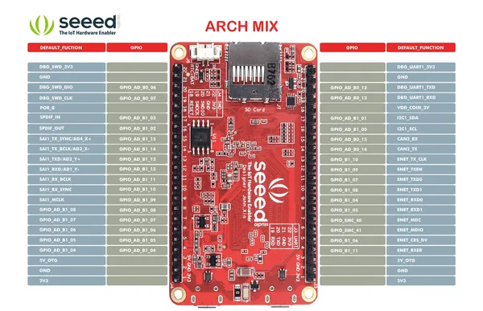
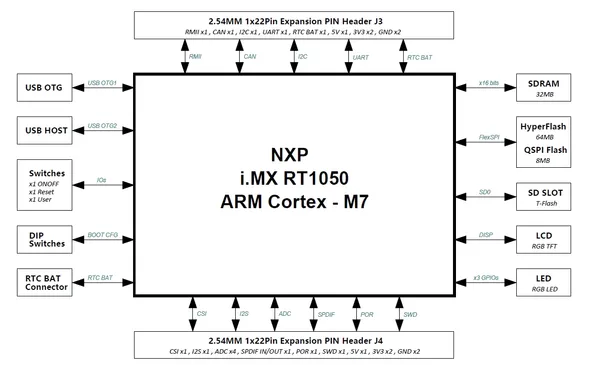
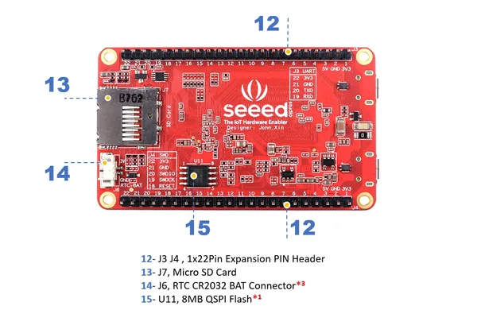
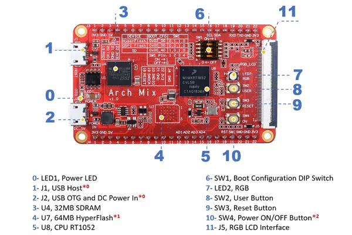

# Arch Mix

**Seeed Studio** · Other

Revision: Not identified  
Coverage: Pinout image collected

[Browse all manufacturers](../../../../BROWSE.md) · [Desktop app](https://github.com/valleytechsolutions/black-wire-desktop)

## Pinout

**pinout image** · Reviewed source · PNG

[Open original reference](../../../../library/media/d61122e78d08e0b8be5316546f322153c4d2e2cc3288e87c7b60c2f35cdd05a0.png)

**Credit and rights:** Not established; source attribution retained. Source/manufacturer: Seeed Studio.

[Source 1](https://files.seeedstudio.com/wiki/Arch_Mix/img/pinout.png) · [Source 2](https://wiki.seeedstudio.com/Arch_Mix/)

Imported from existing Seeed Studio Board Reference; original working path preserved.

SHA-256: `d61122e78d08e0b8be5316546f322153c4d2e2cc3288e87c7b60c2f35cdd05a0`

## Block Diagram

**source reference** · Unreviewed source · JPG

[Open original reference](../../../../library/media/a5d79884b925a5b55245ac4a25e9fe51f0fe73eafce9c3683fb130b90e2fdffb.jpg)

**Credit and rights:** Source rights not yet established. Source/manufacturer: Seeed Studio.

[Source 1](https://files.seeedstudio.com/wiki/Arch_Mix/img/Block.jpg) · [Source 2](https://wiki.seeedstudio.com/Arch_Mix/)

Original source index: Block Diagram. This file is searchable but has not been promoted to a reviewed physical board pinout.

SHA-256: `a5d79884b925a5b55245ac4a25e9fe51f0fe73eafce9c3683fb130b90e2fdffb`

## Dimensions

**source reference** · Unreviewed source · PDF

[Open original reference](../../../../library/media/9613246ab8c3e8f423e8fdbfc9fac80f76164ae612804030062e76ed1c1c767b.pdf)

**Credit and rights:** Source rights not yet established. Source/manufacturer: Seeed Studio.

[Source 1](https://files.seeedstudio.com/wiki/Arch_Mix/res/ARCH%20MIX_V1.0_Dimension.pdf) · [Source 2](https://wiki.seeedstudio.com/Arch_Mix/)

Original source index: Dimensions. This file is searchable but has not been promoted to a reviewed physical board pinout.

SHA-256: `9613246ab8c3e8f423e8fdbfc9fac80f76164ae612804030062e76ed1c1c767b`

## Hardware Overview (Back)

**source reference** · Unreviewed source · JPG

[Open original reference](../../../../library/media/97def91c2f4d61092a29bb169161a62152841311ceb536aeb0882a0e6e7a9e73.jpg)

**Credit and rights:** Source rights not yet established. Source/manufacturer: Seeed Studio.

[Source 1](https://files.seeedstudio.com/wiki/Arch_Mix/img/pinout_b.jpg) · [Source 2](https://wiki.seeedstudio.com/Arch_Mix/)

Original source index: Hardware Overview (Back). This file is searchable but has not been promoted to a reviewed physical board pinout.

SHA-256: `97def91c2f4d61092a29bb169161a62152841311ceb536aeb0882a0e6e7a9e73`

## Hardware Overview (Front)

**source reference** · Unreviewed source · JPG

[Open original reference](../../../../library/media/2a51e474cd69fd89b32f9336f54e9348ebabbb47aa7e8a097960c7d862d898d9.jpg)

**Credit and rights:** Source rights not yet established. Source/manufacturer: Seeed Studio.

[Source 1](https://files.seeedstudio.com/wiki/Arch_Mix/img/pinout_f.jpg) · [Source 2](https://wiki.seeedstudio.com/Arch_Mix/)

Original source index: Hardware Overview (Front). This file is searchable but has not been promoted to a reviewed physical board pinout.

SHA-256: `2a51e474cd69fd89b32f9336f54e9348ebabbb47aa7e8a097960c7d862d898d9`

## Pinout Sheet

**source reference** · Unreviewed source · XLSX

[Open original reference](../../../../library/media/19d853459448e0ec1a39319d682e6f8c80b7841f694d6acb6811d2bc4448f3d6.xlsx)

**Credit and rights:** Source rights not yet established. Source/manufacturer: Seeed Studio.

[Source 1](https://files.seeedstudio.com/wiki/Arch_Mix/res/Arch%20Mix_v1.0_Pin.xlsx) · [Source 2](https://wiki.seeedstudio.com/Arch_Mix/)

Original source index: Pinout Sheet. This file is searchable but has not been promoted to a reviewed physical board pinout.

SHA-256: `19d853459448e0ec1a39319d682e6f8c80b7841f694d6acb6811d2bc4448f3d6`

Pin assignments have not been independently electrically verified. Check board revision before wiring.
