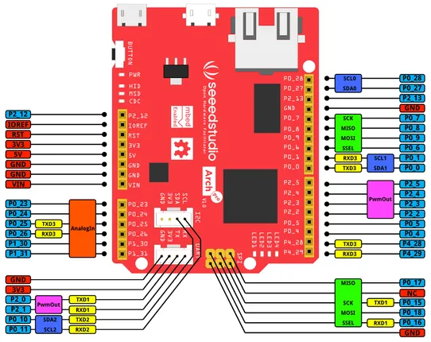

# Arch Pro

**Seeed Studio** · Other

Revision: Not identified  
Coverage: Pinout image collected

[Browse all manufacturers](../../../../BROWSE.md) · [Desktop app](https://github.com/valleytechsolutions/black-wire-desktop)

## Pinout

**pinout image** · Reviewed source · PNG

[Open original reference](../../../../library/media/a1a0532bc6c403616126462fdd8541bb12dd83deb01d5470a5a1cdf65e806809.png)

**Credit and rights:** Not established; source attribution retained. Source/manufacturer: Seeed Studio.

[Source 1](https://files.seeedstudio.com/wiki/Arch_Pro/img/Arch_pro_v1_pinout.png) · [Source 2](https://wiki.seeedstudio.com/Arch_Pro/)

Imported from existing Seeed Studio Board Reference; original working path preserved.

SHA-256: `a1a0532bc6c403616126462fdd8541bb12dd83deb01d5470a5a1cdf65e806809`

Pin assignments have not been independently electrically verified. Check board revision before wiring.
