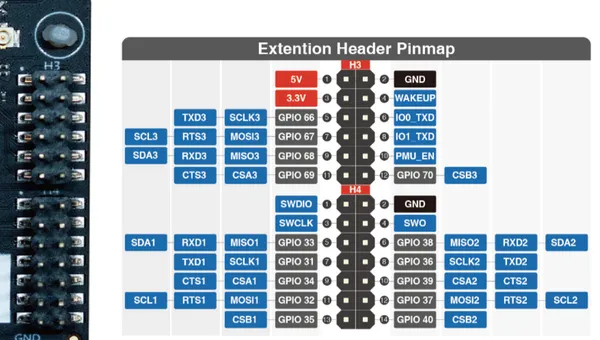
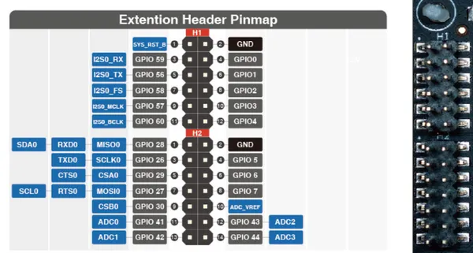
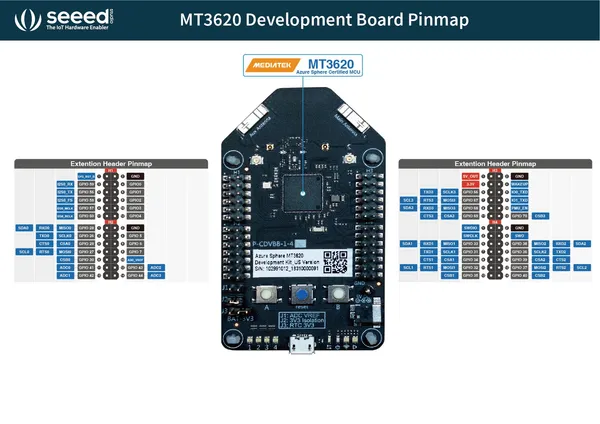
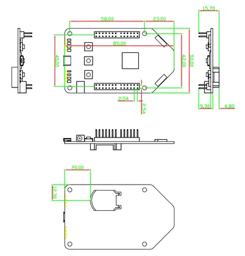
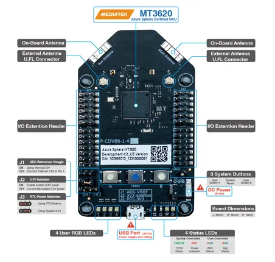

# Azure Sphere MT3620 Development Kit

**Seeed Studio** · Other

Revision: Not identified  
Coverage: Pinout image collected

[Browse all manufacturers](../../../../BROWSE.md) · [Desktop app](https://github.com/valleytechsolutions/black-wire-desktop)

## Pinout Sheet 2

**pinout image** · Reviewed source · PNG

[Open original reference](../../../../library/media/5378fab1a818ba7ba02abdbd0cc991c8dcacc53cec0966a2f171281dc23c6f9d.png)

**Credit and rights:** Not established; source attribution retained. Source/manufacturer: Seeed Studio.

[Source 1](https://files.seeedstudio.com/wiki/Azure_Sphere_MT3620_Development_Kit/img/H3_4.png) · [Source 2](https://wiki.seeedstudio.com/MT3620_Ethernet_Shield_v1.0/)

Imported from existing Seeed Studio Board Reference; original working path preserved. Only the named connector or subsection is covered.

**Partial diagram. Confirm missing pins against the exact board documentation.**

SHA-256: `5378fab1a818ba7ba02abdbd0cc991c8dcacc53cec0966a2f171281dc23c6f9d`

## Pinout Sheet

**pinout image** · Reviewed source · PNG

[Open original reference](../../../../library/media/71ce0b46d6bb7c8e38b0a3dc241baa185e60fd4458edfe7f7627cffb8280e224.png)

**Credit and rights:** Not established; source attribution retained. Source/manufacturer: Seeed Studio.

[Source 1](https://files.seeedstudio.com/wiki/Azure_Sphere_MT3620_Development_Kit/img/H1_2.png) · [Source 2](https://wiki.seeedstudio.com/MT3620_Ethernet_Shield_v1.0/)

Imported from existing Seeed Studio Board Reference; original working path preserved. Only the named connector or subsection is covered.

**Partial diagram. Confirm missing pins against the exact board documentation.**

SHA-256: `71ce0b46d6bb7c8e38b0a3dc241baa185e60fd4458edfe7f7627cffb8280e224`

## Pinout

**pinout image** · Reviewed source · JPG

[Open original reference](../../../../library/media/fcac32894f7735d51e15dc830a43705d8b942c1e43c189718c1bf95a9978669f.jpg)

**Credit and rights:** Not established; source attribution retained. Source/manufacturer: Seeed Studio.

[Source 1](https://files.seeedstudio.com/wiki/Azure_Sphere_MT3620_Development_Kit/img/PinMap.png) · [Source 2](https://wiki.seeedstudio.com/Azure_Sphere_MT3620_Development_Kit/)

Imported from existing Seeed Studio Board Reference; original working path preserved.

SHA-256: `fcac32894f7735d51e15dc830a43705d8b942c1e43c189718c1bf95a9978669f`

## Dimensions

**source reference** · Unreviewed source · PNG

[Open original reference](../../../../library/media/241068585d30879e74d99eeaab612b9abcff00d9168ce4971e302f9a1ece9d61.png)

**Credit and rights:** Source rights not yet established. Source/manufacturer: Seeed Studio.

[Source 1](https://files.seeedstudio.com/wiki/Azure_Sphere_MT3620_Development_Kit/img/dimension.png) · [Source 2](https://wiki.seeedstudio.com/Azure_Sphere_MT3620_Development_Kit/)

Original source index: Dimensions. This file is searchable but has not been promoted to a reviewed physical board pinout.

SHA-256: `241068585d30879e74d99eeaab612b9abcff00d9168ce4971e302f9a1ece9d61`

## Hardware Overview

**source reference** · Unreviewed source · PNG

[Open original reference](../../../../library/media/e34b1491bdb51a1751280f20df573d7988628533d5d7d91d3c734ad2d9ad1c4b.png)

**Credit and rights:** Source rights not yet established. Source/manufacturer: Seeed Studio.

[Source 1](https://files.seeedstudio.com/wiki/Azure_Sphere_MT3620_Development_Kit/img/Diagram.png) · [Source 2](https://wiki.seeedstudio.com/Azure_Sphere_MT3620_Development_Kit/)

Original source index: Hardware Overview. This file is searchable but has not been promoted to a reviewed physical board pinout.

SHA-256: `e34b1491bdb51a1751280f20df573d7988628533d5d7d91d3c734ad2d9ad1c4b`

Pin assignments have not been independently electrically verified. Check board revision before wiring.
