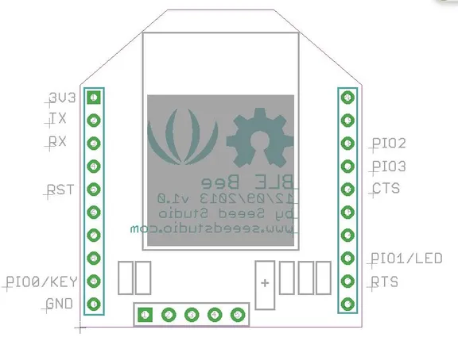

# BLE Bee

**Seeed Studio** · Other

Revision: Not identified  
Coverage: Pinout image collected

[Browse all manufacturers](../../../../BROWSE.md) · [Desktop app](https://github.com/valleytechsolutions/black-wire-desktop)

## Pinout

**pinout image** · Reviewed source · JPG

[Open original reference](../../../../library/media/0a88651d39dda061fc9a80da2520fc78fc73a9d0c9512426188dee573ac84310.jpg)

**Credit and rights:** Not established; source attribution retained. Source/manufacturer: Seeed Studio.

[Source 1](https://files.seeedstudio.com/wiki/BLE_Bee/img/BLE_BEE11.jpg) · [Source 2](https://wiki.seeedstudio.com/BLE_Bee/)

Imported from existing Seeed Studio Board Reference; original working path preserved.

SHA-256: `0a88651d39dda061fc9a80da2520fc78fc73a9d0c9512426188dee573ac84310`

Pin assignments have not been independently electrically verified. Check board revision before wiring.
