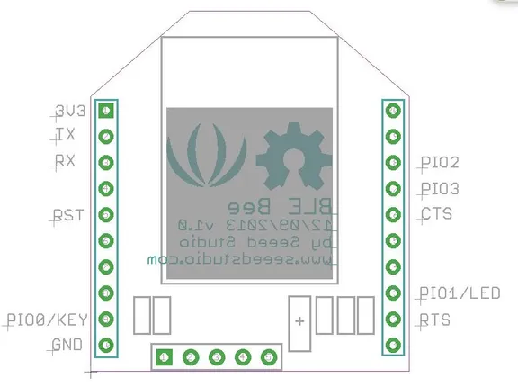

# BLE Bee

**Seeed Studio** · Other

Revision: Not identified

Coverage: Pinout image collected

[Browse all manufacturers](../../../../BROWSE.md) · [Devices & IoT](../../../../DEVICES.md) · [Open in the browser guide](https://valleytech-black-wire-guide.pages.dev/?board=seeed-studio-other-ble-bee)

## Datasheets and original documentation

Board datasheet: **not yet recorded**. Visual reference: **available**.

[Manufacturer source (recorded link)](https://wiki.seeedstudio.com/BLE_Bee/)

A chip datasheet, schematic and board datasheet have different scopes. Match the exact hardware revision.

[Documentation coverage and remaining gaps](../../../../DOCUMENTATION.md)

## Pinout

**pinout image** · Reviewed source · JPG

[Open original reference](../../../../library/media/0a88651d39dda061fc9a80da2520fc78fc73a9d0c9512426188dee573ac84310.jpg)

**Credit and rights:** Not established; source attribution retained. Source/manufacturer: Seeed Studio.

[Source 1](https://files.seeedstudio.com/wiki/BLE_Bee/img/BLE_BEE11.jpg) · [Source 2](https://wiki.seeedstudio.com/BLE_Bee/)

Imported from existing Seeed Studio Board Reference; original working path preserved.

Image revision: Not identified

SHA-256: `0a88651d39dda061fc9a80da2520fc78fc73a9d0c9512426188dee573ac84310`

Pin assignments have not been independently electrically verified. Check board revision before wiring.
