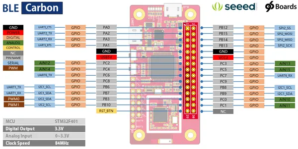
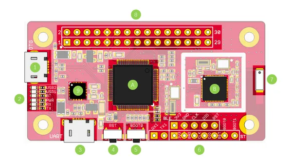

# BLE Carbon

**Seeed Studio** · Other

Revision: Not identified  
Coverage: Pinout image collected

[Browse all manufacturers](../../../../BROWSE.md) · [Desktop app](https://github.com/valleytechsolutions/black-wire-desktop)

## Pinout

**pinout image** · Reviewed source · PNG

[Open original reference](../../../../library/media/af54334429b06ab634a585a81349ef37383df931bc5ce5acdac0362be7b3be49.png)

**Credit and rights:** Not established; source attribution retained. Source/manufacturer: Seeed Studio.

[Source 1](https://files.seeedstudio.com/wiki/BLE-Carbon/img/pinout.png) · [Source 2](https://wiki.seeedstudio.com/BLE_Carbon/)

Imported from existing Seeed Studio Board Reference; original working path preserved.

SHA-256: `af54334429b06ab634a585a81349ef37383df931bc5ce5acdac0362be7b3be49`

## Hardware Overview

**source reference** · Unreviewed source · PNG

[Open original reference](../../../../library/media/5f5bd21db6aa23b9f6afa06cbe4c25aa614589d6794c573297ade2229e8514e1.png)

**Credit and rights:** Source rights not yet established. Source/manufacturer: Seeed Studio.

[Source 1](https://files.seeedstudio.com/wiki/BLE-Carbon/img/hw.png) · [Source 2](https://wiki.seeedstudio.com/BLE_Carbon/)

Original source index: Hardware Overview. This file is searchable but has not been promoted to a reviewed physical board pinout.

SHA-256: `5f5bd21db6aa23b9f6afa06cbe4c25aa614589d6794c573297ade2229e8514e1`

Pin assignments have not been independently electrically verified. Check board revision before wiring.
