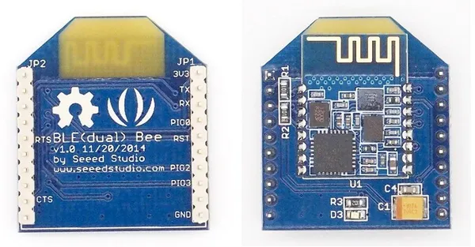

# BLE (Dual) Bee V1.0

**Seeed Studio** · Other

Revision: Not identified  
Coverage: Board labels only; pinout needed

[Browse all manufacturers](../../../../BROWSE.md) · [Desktop app](https://github.com/valleytechsolutions/black-wire-desktop)

## Pinout

**board labeling image** · Reviewed source · JPG

[Open original reference](../../../../library/media/e61b18e345936b119c70d99900881e55200f493c87268059eee8c10a907cad3b.jpg)

**Credit and rights:** Not established; source attribution retained. Source/manufacturer: Seeed Studio.

[Source 1](https://raw.githubusercontent.com/SeeedDocument/BLE_dual_Bee_v1.0/master/img/Editing_BLE-dual-Bee_v1.0_PhotoBottom.jpg) · [Source 2](https://wiki.seeedstudio.com/BLE_dual_Bee_v1.0/)

Imported from existing Seeed Studio Board Reference; original working path preserved.

SHA-256: `e61b18e345936b119c70d99900881e55200f493c87268059eee8c10a907cad3b`

Pin assignments have not been independently electrically verified. Check board revision before wiring.
