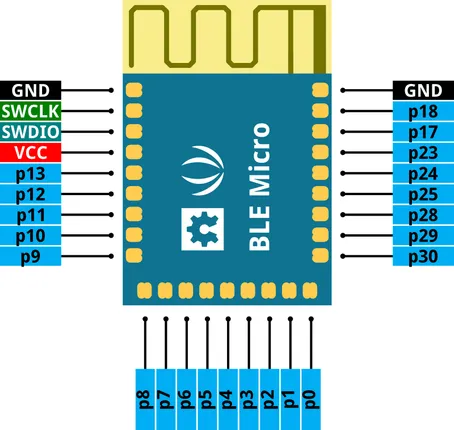
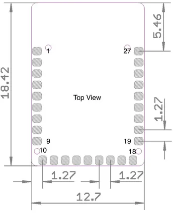

# BLE Micro

**Seeed Studio** · Other

Revision: Not identified  
Coverage: Pinout image collected

[Browse all manufacturers](../../../../BROWSE.md) · [Desktop app](https://github.com/valleytechsolutions/black-wire-desktop)

## Pinout

**pinout image** · Reviewed source · PNG

[Open original reference](../../../../library/media/2a54e9e2bad44f5f67387311c63cc0d01ee1b36fa567c1f439714e3c51f5f891.png)

**Credit and rights:** Not established; source attribution retained. Source/manufacturer: Seeed Studio.

[Source 1](https://files.seeedstudio.com/wiki/BLE_Micro/img/BLE_Micro_Pinout.png) · [Source 2](https://wiki.seeedstudio.com/BLE_Micro/)

Imported from existing Seeed Studio Board Reference; original working path preserved.

SHA-256: `2a54e9e2bad44f5f67387311c63cc0d01ee1b36fa567c1f439714e3c51f5f891`

## Dimensions

**source reference** · Unreviewed source · JPG

[Open original reference](../../../../library/media/8f10c847383cfdac80c167a93855ce24b2b59c37f0dfee4fe20861e98d0a33e4.jpg)

**Credit and rights:** Source rights not yet established. Source/manufacturer: Seeed Studio.

[Source 1](https://files.seeedstudio.com/wiki/BLE_Micro/img/BLE_Micro_Dimension.jpeg) · [Source 2](https://wiki.seeedstudio.com/BLE_Micro/)

Original source index: Dimensions. This file is searchable but has not been promoted to a reviewed physical board pinout.

SHA-256: `8f10c847383cfdac80c167a93855ce24b2b59c37f0dfee4fe20861e98d0a33e4`

Pin assignments have not been independently electrically verified. Check board revision before wiring.
