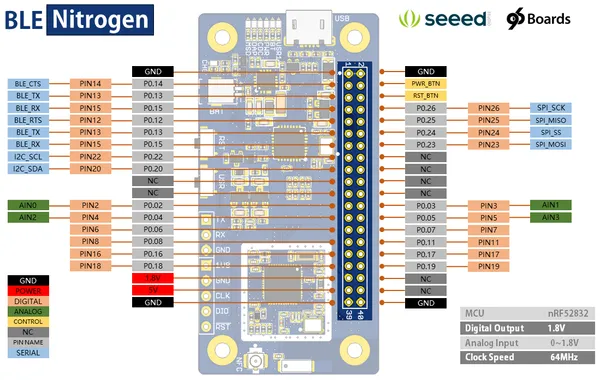
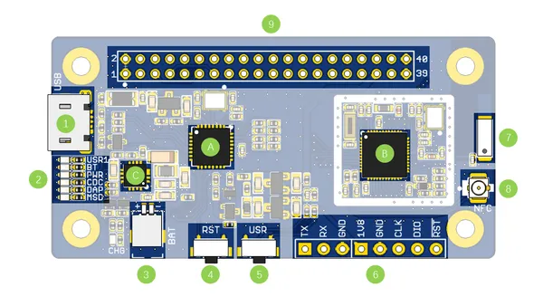

# BLE Nitrogen

**Seeed Studio** · Other

Revision: Not identified  
Coverage: Pinout image collected

[Browse all manufacturers](../../../../BROWSE.md) · [Desktop app](https://github.com/valleytechsolutions/black-wire-desktop)

## Pinout

**pinout image** · Reviewed source · PNG

[Open original reference](../../../../library/media/58453ead1c57b5b1ef068ed3d86f5cd8ff469ca924d069f561f6f5fb821f69b7.png)

**Credit and rights:** Not established; source attribution retained. Source/manufacturer: Seeed Studio.

[Source 1](https://files.seeedstudio.com/wiki/BLE-Nitrogen/img/pin_map.png) · [Source 2](https://wiki.seeedstudio.com/BLE_Nitrogen/)

Imported from existing Seeed Studio Board Reference; original working path preserved.

SHA-256: `58453ead1c57b5b1ef068ed3d86f5cd8ff469ca924d069f561f6f5fb821f69b7`

## Hardware Overview

**source reference** · Unreviewed source · PNG

[Open original reference](../../../../library/media/2fdd784b600a979a381a685831debdde3c7f589a93746cea48a8b91f3ebd4873.png)

**Credit and rights:** Source rights not yet established. Source/manufacturer: Seeed Studio.

[Source 1](https://files.seeedstudio.com/wiki/BLE-Nitrogen/img/hardware_ov.png) · [Source 2](https://wiki.seeedstudio.com/BLE_Nitrogen/)

Original source index: Hardware Overview. This file is searchable but has not been promoted to a reviewed physical board pinout.

SHA-256: `2fdd784b600a979a381a685831debdde3c7f589a93746cea48a8b91f3ebd4873`

Pin assignments have not been independently electrically verified. Check board revision before wiring.
