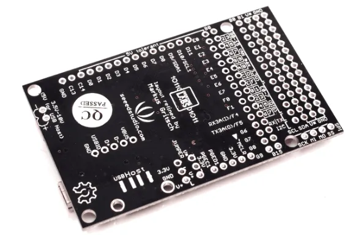
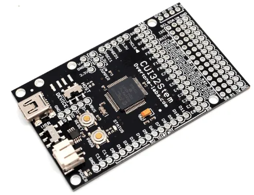

# CUI32Stem

**Seeed Studio** · Other

Revision: Not identified  
Coverage: Board labels only; pinout needed

[Browse all manufacturers](../../../../BROWSE.md) · [Desktop app](https://github.com/valleytechsolutions/black-wire-desktop)

## Pinout (Back)

**board labeling image** · Reviewed source · PNG

[Open original reference](../../../../library/media/937a8a82f4fb88c0b3146ea1e13bff54a67a9dd31209f96d8e0d0d81b2467fc6.png)

**Credit and rights:** Not established; source attribution retained. Source/manufacturer: Seeed Studio.

[Source 1](https://files.seeedstudio.com/wiki/CUI32Stem/img/CUI32StemBackSmall.png) · [Source 2](https://wiki.seeedstudio.com/CUI32Stem/)

Imported from existing Seeed Studio Board Reference; original working path preserved.

SHA-256: `937a8a82f4fb88c0b3146ea1e13bff54a67a9dd31209f96d8e0d0d81b2467fc6`

## Pinout (Front)

**board labeling image** · Reviewed source · PNG

[Open original reference](../../../../library/media/ec47b997c33d338bd8672f165615b1a346c91a449ca4e3e393ce4ccb349f676e.png)

**Credit and rights:** Not established; source attribution retained. Source/manufacturer: Seeed Studio.

[Source 1](https://files.seeedstudio.com/wiki/CUI32Stem/img/CUI32StemFrontSmall.png) · [Source 2](https://wiki.seeedstudio.com/CUI32Stem/)

Imported from existing Seeed Studio Board Reference; original working path preserved.

SHA-256: `ec47b997c33d338bd8672f165615b1a346c91a449ca4e3e393ce4ccb349f676e`

Pin assignments have not been independently electrically verified. Check board revision before wiring.
