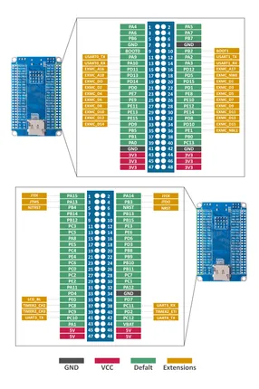
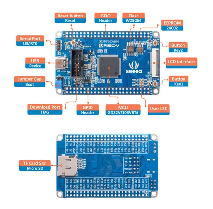

# GD32 RISC-V Dev Board

**Seeed Studio** · Other

Revision: Not identified  
Coverage: Pinout image collected

[Browse all manufacturers](../../../../BROWSE.md) · [Desktop app](https://github.com/valleytechsolutions/black-wire-desktop)

## Pinout

**pinout image** · Reviewed source · JPG

[Open original reference](../../../../library/media/a522fd1c2554893c5e90cf31ebf8692262c8af748c7b027c23da5c91696fe520.jpg)

**Credit and rights:** Not established; source attribution retained. Source/manufacturer: Seeed Studio.

[Source 1](https://files.seeedstudio.com/wiki/GD32VF103/img/GD32VF-103VBT6-c.jpg) · [Source 2](https://wiki.seeedstudio.com/SeeedStudio-GD32-RISC-V-Dev-Board/)

Imported from existing Seeed Studio Board Reference; original working path preserved.

SHA-256: `a522fd1c2554893c5e90cf31ebf8692262c8af748c7b027c23da5c91696fe520`

## Hardware Overview

**source reference** · Unreviewed source · JPG

[Open original reference](../../../../library/media/ff3f9e45e8a7fdb6a6dcc5ce322b9805b9a870b00821332410df19999d8604bf.jpg)

**Credit and rights:** Source rights not yet established. Source/manufacturer: Seeed Studio.

[Source 1](https://files.seeedstudio.com/wiki/GD32VF103/img/GD32VF-103VBT6-pin.jpg) · [Source 2](https://wiki.seeedstudio.com/SeeedStudio-GD32-RISC-V-Dev-Board/)

Original source index: Hardware Overview. This file is searchable but has not been promoted to a reviewed physical board pinout.

SHA-256: `ff3f9e45e8a7fdb6a6dcc5ce322b9805b9a870b00821332410df19999d8604bf`

Pin assignments have not been independently electrically verified. Check board revision before wiring.
