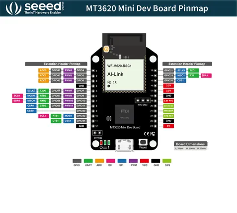
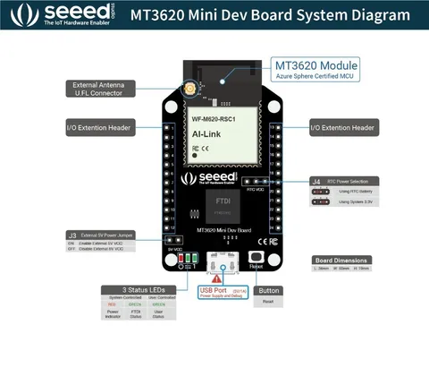

# MT3620 Mini Dev Board

**Seeed Studio** · Other

Revision: Not identified  
Coverage: Pinout image collected

[Browse all manufacturers](../../../../BROWSE.md) · [Desktop app](https://github.com/valleytechsolutions/black-wire-desktop)

## Pinout

**pinout image** · Reviewed source · JPG

[Open original reference](../../../../library/media/41df878feb8f3d33694a8046a988717f9073034267c2e29c871bf51f1d6edbc0.jpg)

**Credit and rights:** Not established; source attribution retained. Source/manufacturer: Seeed Studio.

[Source 1](https://files.seeedstudio.com/products/102110267/img/MT3620 Mini Dev Board Pinmap-20200331.jpg) · [Source 2](https://wiki.seeedstudio.com/MT3620_Mini_Dev_Board/)

Imported from existing Seeed Studio Board Reference; original working path preserved.

SHA-256: `41df878feb8f3d33694a8046a988717f9073034267c2e29c871bf51f1d6edbc0`

## Hardware Overview

**source reference** · Unreviewed source · JPG

[Open original reference](../../../../library/media/05bcd8d25b54829cc940e07ff6b84e43669023aac49483617ce76cc043191f42.jpg)

**Credit and rights:** Source rights not yet established. Source/manufacturer: Seeed Studio.

[Source 1](https://files.seeedstudio.com/wiki/MT3620_Mini_Dev_Board/img/sys.jpg) · [Source 2](https://wiki.seeedstudio.com/MT3620_Mini_Dev_Board/)

Original source index: Hardware Overview. This file is searchable but has not been promoted to a reviewed physical board pinout.

SHA-256: `05bcd8d25b54829cc940e07ff6b84e43669023aac49483617ce76cc043191f42`

Pin assignments have not been independently electrically verified. Check board revision before wiring.
