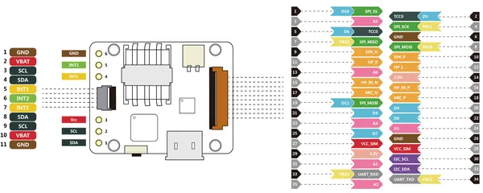
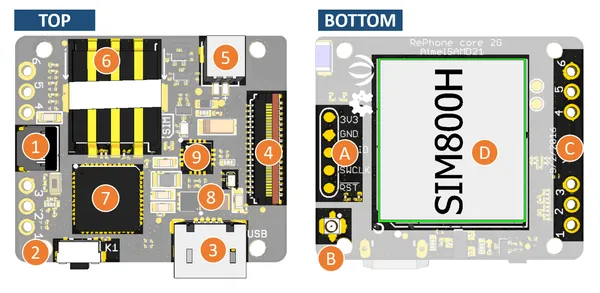

# RePhone Core 2G-AtmelSAMD21

**Seeed Studio** · Other

Revision: Not identified  
Coverage: Pinout image collected

[Browse all manufacturers](../../../../BROWSE.md) · [Desktop app](https://github.com/valleytechsolutions/black-wire-desktop)

## Pinout

**pinout image** · Reviewed source · PNG

[Open original reference](../../../../library/media/13f3132f188d02e8d3d28b28becdc9aa9292ca2fcb6989b94c4b3b0e977c5d10.png)

**Credit and rights:** Not established; source attribution retained. Source/manufacturer: Seeed Studio.

[Source 1](https://files.seeedstudio.com/wiki/RePhone-core-2G-AtmelSAMD21/img/pinmap.png) · [Source 2](https://wiki.seeedstudio.com/Rephone_core_2G-AtmelSAMD21/)

Imported from existing Seeed Studio Board Reference; original working path preserved.

SHA-256: `13f3132f188d02e8d3d28b28becdc9aa9292ca2fcb6989b94c4b3b0e977c5d10`

## Hardware Overview

**source reference** · Unreviewed source · PNG

[Open original reference](../../../../library/media/88cfc5f65d8c33b66bc3da11cc3f7c2653529c3bdc26712457bea52478448f5e.png)

**Credit and rights:** Source rights not yet established. Source/manufacturer: Seeed Studio.

Original source index: Hardware Overview. This file is searchable but has not been promoted to a reviewed physical board pinout.

SHA-256: `88cfc5f65d8c33b66bc3da11cc3f7c2653529c3bdc26712457bea52478448f5e`

Pin assignments have not been independently electrically verified. Check board revision before wiring.
