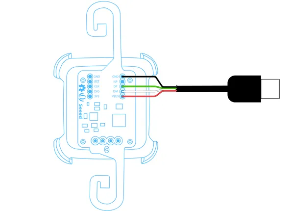
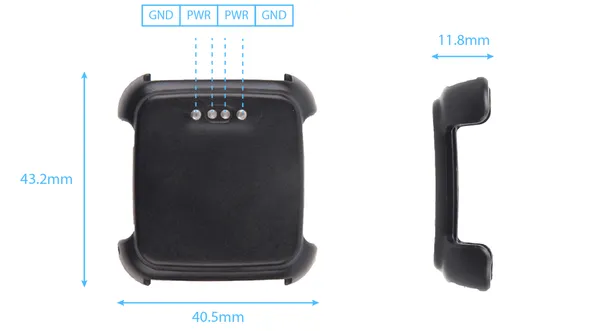

# RePhone Strap Kit for Pebble

**Seeed Studio** · Other

Revision: Not identified  
Coverage: Partial pinout collected; full reference still needed

[Browse all manufacturers](../../../../BROWSE.md) · [Desktop app](https://github.com/valleytechsolutions/black-wire-desktop)

## Pinout (Adapter)

**pinout image** · Reviewed source · PNG

[Open original reference](../../../../library/media/717550fbff9948ff3edcb65bd75a6084961c0dbade83e3680c18fd5abb6928e9.png)

**Credit and rights:** Not established; source attribution retained. Source/manufacturer: Seeed Studio.

[Source 1](https://files.seeedstudio.com/wiki/RePhone_Strap_Kit_for_Pebble/img/Hack_USB_cable-03.png) · [Source 2](https://wiki.seeedstudio.com/RePhone_Strap_Kit_for_Pebble/)

Imported from existing Seeed Studio Board Reference; original working path preserved. Only the named connector or subsection is covered.

**Partial diagram. Confirm missing pins against the exact board documentation.**

SHA-256: `717550fbff9948ff3edcb65bd75a6084961c0dbade83e3680c18fd5abb6928e9`

## Dimensions (Base)

**source reference** · Unreviewed source · PNG

[Open original reference](../../../../library/media/4c76c767e58cc18dff2290476f3df4a67f38786637f0f61d1cc5c4d5d4bca9d4.png)

**Credit and rights:** Source rights not yet established. Source/manufacturer: Seeed Studio.

[Source 1](https://files.seeedstudio.com/wiki/RePhone_Strap_Kit_for_Pebble/img/Pebble_base_2.png) · [Source 2](https://wiki.seeedstudio.com/RePhone_Strap_Kit_for_Pebble/)

Original source index: Dimensions (Base). This file is searchable but has not been promoted to a reviewed physical board pinout.

SHA-256: `4c76c767e58cc18dff2290476f3df4a67f38786637f0f61d1cc5c4d5d4bca9d4`

Pin assignments have not been independently electrically verified. Check board revision before wiring.
