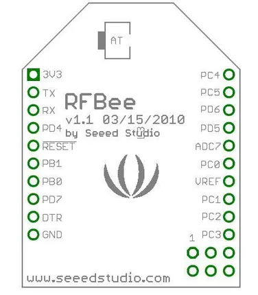

# RFbee V1.1

**Seeed Studio** · Other

Revision: Not identified  
Coverage: Pinout image collected

[Browse all manufacturers](../../../../BROWSE.md) · [Desktop app](https://github.com/valleytechsolutions/black-wire-desktop)

## Pinout

**pinout image** · Reviewed source · JPG

[Open original reference](../../../../library/media/e40ab592bb88da213595332bb146be9d14921cdb6ad9edb33c34fab185833121.jpg)

**Credit and rights:** Not established; source attribution retained. Source/manufacturer: Seeed Studio.

[Source 1](https://files.seeedstudio.com/wiki/RFbee_V1.1-Wireless_Arduino_compatible_node/img/RFBee-pin.jpg) · [Source 2](https://wiki.seeedstudio.com/RFbee_V1.1-Wireless_Arduino_compatible_node/)

Imported from existing Seeed Studio Board Reference; original working path preserved.

SHA-256: `e40ab592bb88da213595332bb146be9d14921cdb6ad9edb33c34fab185833121`

Pin assignments have not been independently electrically verified. Check board revision before wiring.
