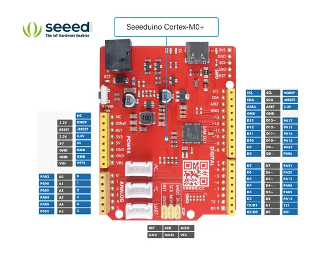
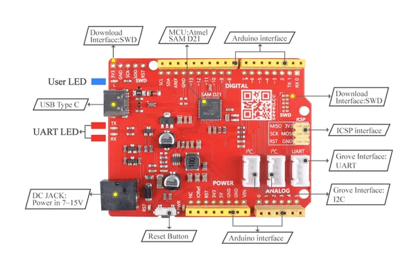
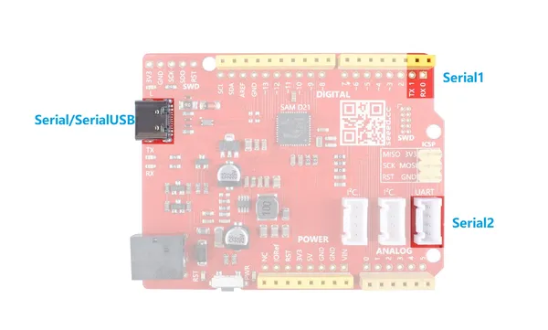

# Seeeduino Cortex-M0+

**Seeed Studio** · Other

Revision: Not identified  
Coverage: Pinout image collected

[Browse all manufacturers](../../../../BROWSE.md) · [Desktop app](https://github.com/valleytechsolutions/black-wire-desktop)

## Pinout

**pinout image** · Reviewed source · JPG

[Open original reference](../../../../library/media/845359b327b17947e5cf442c36a9f9f7985c1769fac6c714bf02b2a991a5cdad.jpg)

**Credit and rights:** Not established; source attribution retained. Source/manufacturer: Seeed Studio.

[Source 1](https://files.seeedstudio.com/wiki/Seeeduino-Cortex-M0-/img/102010248-pinout.jpg) · [Source 2](https://wiki.seeedstudio.com/Seeeduino-Cortex-M0/)

Imported from existing Seeed Studio Board Reference; original working path preserved.

SHA-256: `845359b327b17947e5cf442c36a9f9f7985c1769fac6c714bf02b2a991a5cdad`

## Hardware Overview

**source reference** · Unreviewed source · PNG

[Open original reference](../../../../library/media/bb66766c2c0b65d5167bdd82d2006acfd2d44d29debd660d7b7c0f4e5642890f.png)

**Credit and rights:** Source rights not yet established. Source/manufacturer: Seeed Studio.

[Source 1](https://files.seeedstudio.com/wiki/Seeeduino-Cortex-M0-/img/hardware.png) · [Source 2](https://wiki.seeedstudio.com/Seeeduino-Cortex-M0/)

Original source index: Hardware Overview. This file is searchable but has not been promoted to a reviewed physical board pinout.

SHA-256: `bb66766c2c0b65d5167bdd82d2006acfd2d44d29debd660d7b7c0f4e5642890f`

## Pin Multiplexing (UART)

**source reference** · Unreviewed source · JPG

[Open original reference](../../../../library/media/6eae39c431b9f830b59945d6a337c40f0cb497aaaf27171d4dc429fac01fe462.jpg)

**Credit and rights:** Source rights not yet established. Source/manufacturer: Seeed Studio.

[Source 1](https://files.seeedstudio.com/wiki/Seeeduino-Cortex-M0-/img/UART(1).jpg) · [Source 2](https://wiki.seeedstudio.com/Seeeduino-Cortex-M0/)

Original source index: Pin Multiplexing (UART). This file is searchable but has not been promoted to a reviewed physical board pinout.

SHA-256: `6eae39c431b9f830b59945d6a337c40f0cb497aaaf27171d4dc429fac01fe462`

Pin assignments have not been independently electrically verified. Check board revision before wiring.
