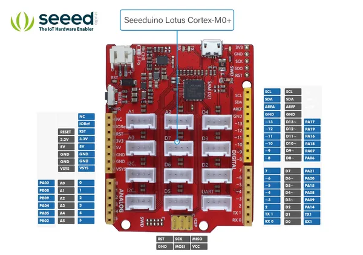
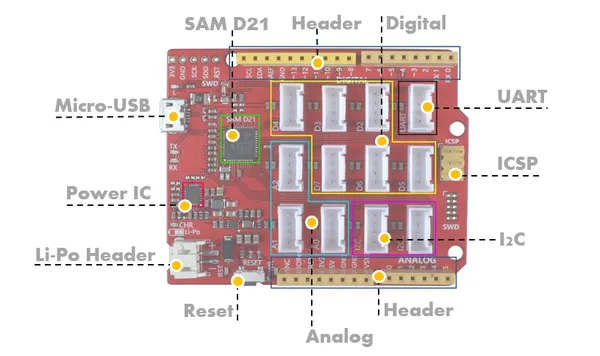
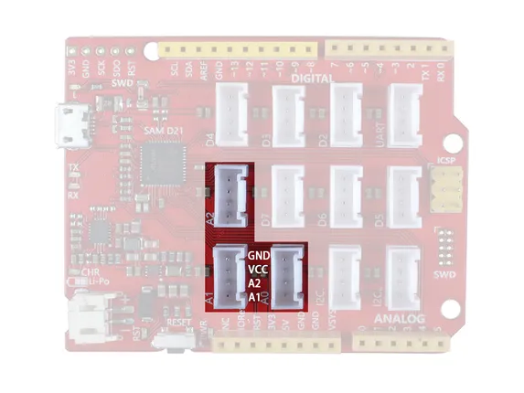
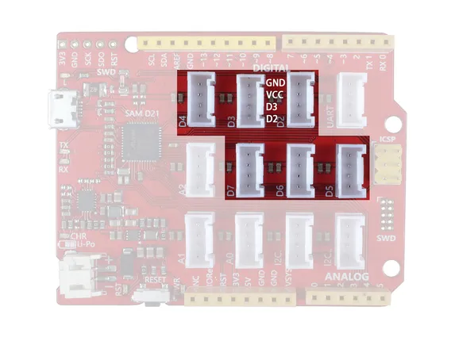
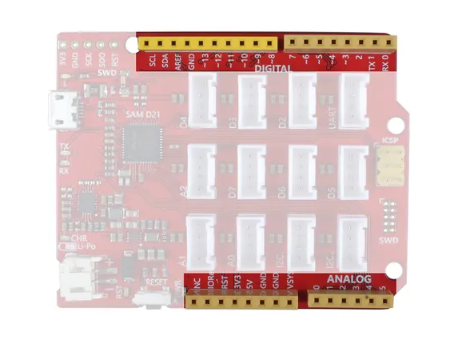
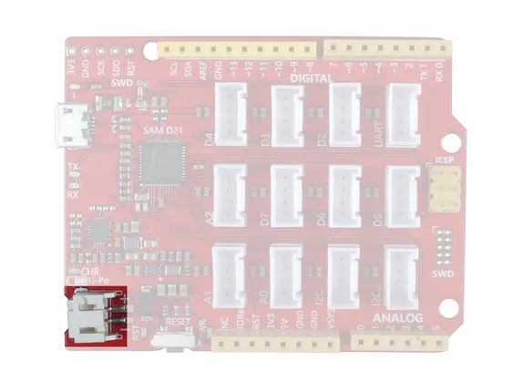
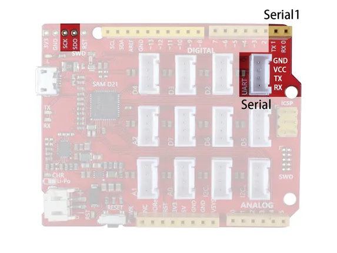

# Seeeduino Lotus Cortex-M0+

**Seeed Studio** · Other

Revision: Not identified  
Coverage: Pinout image collected

[Browse all manufacturers](../../../../BROWSE.md) · [Desktop app](https://github.com/valleytechsolutions/black-wire-desktop)

## Pinout

**pinout image** · Reviewed source · JPG

[Open original reference](../../../../library/media/db35ee7cbce5ff00d1b6bb4d11d8e9b26a767c512da9edf0881cfd525d7b23bf.jpg)

**Credit and rights:** Not established; source attribution retained. Source/manufacturer: Seeed Studio.

[Source 1](https://files.seeedstudio.com/wiki/Seeeduino_Lotus_Cortex-M0-/img/Pin_out.jpg) · [Source 2](https://wiki.seeedstudio.com/Seeeduino_Lotus_Cortex-M0-/)

Imported from existing Seeed Studio Board Reference; original working path preserved.

SHA-256: `db35ee7cbce5ff00d1b6bb4d11d8e9b26a767c512da9edf0881cfd525d7b23bf`

## Hardware Overview

**source reference** · Unreviewed source · JPG

[Open original reference](../../../../library/media/d3acc58053efb843b7787e4af09bcc43f4c1d4d0256a6e6b2403f353614f0bb1.jpg)

**Credit and rights:** Source rights not yet established. Source/manufacturer: Seeed Studio.

[Source 1](https://files.seeedstudio.com/wiki/Seeeduino_Lotus_Cortex-M0-/img/block/overview.jpg) · [Source 2](https://wiki.seeedstudio.com/Seeeduino_Lotus_Cortex-M0-/)

Original source index: Hardware Overview. This file is searchable but has not been promoted to a reviewed physical board pinout.

SHA-256: `d3acc58053efb843b7787e4af09bcc43f4c1d4d0256a6e6b2403f353614f0bb1`

## Interfaces (Analog Grove)

**source reference** · Unreviewed source · JPG

[Open original reference](../../../../library/media/4a64772838506f86d75b7bce85fbab732190b3a11ee343e56a2c9d55fa4d1771.jpg)

**Credit and rights:** Source rights not yet established. Source/manufacturer: Seeed Studio.

[Source 1](https://files.seeedstudio.com/wiki/Seeeduino_Lotus_Cortex-M0-/img/block/5.jpg) · [Source 2](https://wiki.seeedstudio.com/Seeeduino_Lotus_Cortex-M0-/)

Original source index: Interfaces (Analog Grove). This file is searchable but has not been promoted to a reviewed physical board pinout.

SHA-256: `4a64772838506f86d75b7bce85fbab732190b3a11ee343e56a2c9d55fa4d1771`

## Interfaces (Digital Grove)

**source reference** · Unreviewed source · JPG

[Open original reference](../../../../library/media/8a7a74bf825c331f0336532a8a204664d0858ef6fde720c6ab1105437ac0e9d6.jpg)

**Credit and rights:** Source rights not yet established. Source/manufacturer: Seeed Studio.

[Source 1](https://files.seeedstudio.com/wiki/Seeeduino_Lotus_Cortex-M0-/img/block/4.jpg) · [Source 2](https://wiki.seeedstudio.com/Seeeduino_Lotus_Cortex-M0-/)

Original source index: Interfaces (Digital Grove). This file is searchable but has not been promoted to a reviewed physical board pinout.

SHA-256: `8a7a74bf825c331f0336532a8a204664d0858ef6fde720c6ab1105437ac0e9d6`

## Interfaces (Female Header)

**source reference** · Unreviewed source · JPG

[Open original reference](../../../../library/media/fd28954c5c50148ce4f1ba85614d7c2b7f9c4ab63d198d1c27f5ecda8ebb7676.jpg)

**Credit and rights:** Source rights not yet established. Source/manufacturer: Seeed Studio.

[Source 1](https://files.seeedstudio.com/wiki/Seeeduino_Lotus_Cortex-M0-/img/block/2.jpg) · [Source 2](https://wiki.seeedstudio.com/Seeeduino_Lotus_Cortex-M0-/)

Original source index: Interfaces (Female Header). This file is searchable but has not been promoted to a reviewed physical board pinout.

SHA-256: `fd28954c5c50148ce4f1ba85614d7c2b7f9c4ab63d198d1c27f5ecda8ebb7676`

## Interfaces (Li-Po Header)

**source reference** · Unreviewed source · JPG

[Open original reference](../../../../library/media/42ef0e7501990f44abd4a4d94443734f95ca2b9b578064389bdb71a51bad6b38.jpg)

**Credit and rights:** Source rights not yet established. Source/manufacturer: Seeed Studio.

[Source 1](https://files.seeedstudio.com/wiki/Seeeduino_Lotus_Cortex-M0-/img/block/7.jpg) · [Source 2](https://wiki.seeedstudio.com/Seeeduino_Lotus_Cortex-M0-/)

Original source index: Interfaces (Li-Po Header). This file is searchable but has not been promoted to a reviewed physical board pinout.

SHA-256: `42ef0e7501990f44abd4a4d94443734f95ca2b9b578064389bdb71a51bad6b38`

## Interfaces (Serial)

**source reference** · Unreviewed source · JPG

[Open original reference](../../../../library/media/4b3e8071efc99f3c1f9822e0f55c8568f9765b877d26c94a7610c03462a0db14.jpg)

**Credit and rights:** Source rights not yet established. Source/manufacturer: Seeed Studio.

[Source 1](https://files.seeedstudio.com/wiki/Seeeduino_Lotus_Cortex-M0-/img/block/3.jpg) · [Source 2](https://wiki.seeedstudio.com/Seeeduino_Lotus_Cortex-M0-/)

Original source index: Interfaces (Serial). This file is searchable but has not been promoted to a reviewed physical board pinout.

SHA-256: `4b3e8071efc99f3c1f9822e0f55c8568f9765b877d26c94a7610c03462a0db14`

Pin assignments have not been independently electrically verified. Check board revision before wiring.
