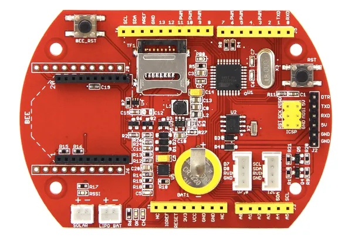

# Seeeduino Stalker

**Seeed Studio** · Other

Revision: Not identified  
Coverage: Board labels only; pinout needed

[Browse all manufacturers](../../../../BROWSE.md) · [Desktop app](https://github.com/valleytechsolutions/black-wire-desktop)

## Pinout

**board labeling image** · Reviewed source · PNG

[Open original reference](../../../../library/media/61db985ac0bd4032e9e951fa0109a634fe09236845b846082995da204c622912.png)

**Credit and rights:** Not established; source attribution retained. Source/manufacturer: Seeed Studio.

[Source 1](https://files.seeedstudio.com/wiki/Seeeduino_Stalker/img/Seeed_Stalker_v3-6.png) · [Source 2](https://wiki.seeedstudio.com/Seeeduino_Stalker/)

Imported from existing Seeed Studio Board Reference; original working path preserved.

SHA-256: `61db985ac0bd4032e9e951fa0109a634fe09236845b846082995da204c622912`

Pin assignments have not been independently electrically verified. Check board revision before wiring.
