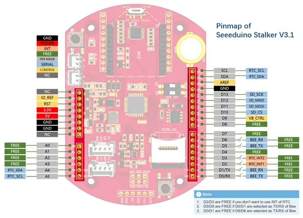
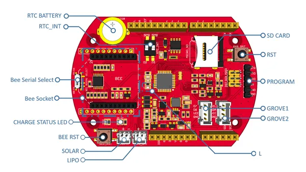

# Seeeduino Stalker V3.1

**Seeed Studio** · Other

Revision: Not identified  
Coverage: Pinout image collected

[Browse all manufacturers](../../../../BROWSE.md) · [Desktop app](https://github.com/valleytechsolutions/black-wire-desktop)

## Pinout

**pinout image** · Reviewed source · PNG

[Open original reference](../../../../library/media/41cb97be4d96f01ab4667e93cf99c375c2aa94eca76f083193acf4628d5798d5.png)

**Credit and rights:** Not established; source attribution retained. Source/manufacturer: Seeed Studio.

[Source 1](https://files.seeedstudio.com/wiki/Seeeduino_Stalker_V3_1/images/pinmap1.png) · [Source 2](https://wiki.seeedstudio.com/Seeeduino_Stalker_V3.1/)

Imported from existing Seeed Studio Board Reference; original working path preserved.

SHA-256: `41cb97be4d96f01ab4667e93cf99c375c2aa94eca76f083193acf4628d5798d5`

## Hardware Overview

**source reference** · Unreviewed source · PNG

[Open original reference](../../../../library/media/55cb2055324f8e0f259bba972560f4edd982144b1b4605c037718c8503892bb3.png)

**Credit and rights:** Source rights not yet established. Source/manufacturer: Seeed Studio.

[Source 1](https://files.seeedstudio.com/wiki/Seeeduino_Stalker_V3_1/images/overview.png) · [Source 2](https://wiki.seeedstudio.com/Seeeduino_Stalker_V3.1/)

Original source index: Hardware Overview. This file is searchable but has not been promoted to a reviewed physical board pinout.

SHA-256: `55cb2055324f8e0f259bba972560f4edd982144b1b4605c037718c8503892bb3`

Pin assignments have not been independently electrically verified. Check board revision before wiring.
