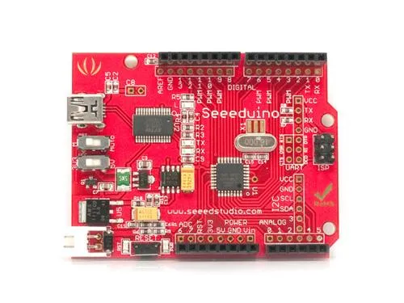

# Seeeduino V2

**Seeed Studio** · Other

Revision: V2, source label

Coverage: Board labels only; pinout needed

[Browse all manufacturers](../../../../BROWSE.md) · [Devices & IoT](../../../../DEVICES.md) · [Open in the browser guide](https://valleytech-black-wire-guide.pages.dev/?board=seeed-studio-other-seeeduino-v2)

## Datasheets and original documentation

Board datasheet: **not yet recorded**. Visual reference: **available**.

[Manufacturer source (recorded link)](https://wiki.seeedstudio.com/Seeeduino/)

A chip datasheet, schematic and board datasheet have different scopes. Match the exact hardware revision.

[Documentation coverage and remaining gaps](../../../../DOCUMENTATION.md)

## Pinout (v2)

**board labeling image** · Reviewed source · JPG

[Open original reference](../../../../library/media/a51d081989ae5d2d226ec7d0412f9b6470a0597e2c1c8638bf07cad9686c86c0.jpg)

**Credit and rights:** Not established; source attribution retained. Source/manufacturer: Seeed Studio.

[Source 1](https://files.seeedstudio.com/wiki/Seeeduino/img/Seeeduinov2211_02.jpg) · [Source 2](https://wiki.seeedstudio.com/Seeeduino/)

Imported from existing Seeed Studio Board Reference; original working path preserved.

Image revision: V2, source label

SHA-256: `a51d081989ae5d2d226ec7d0412f9b6470a0597e2c1c8638bf07cad9686c86c0`

Pin assignments have not been independently electrically verified. Check board revision before wiring.
