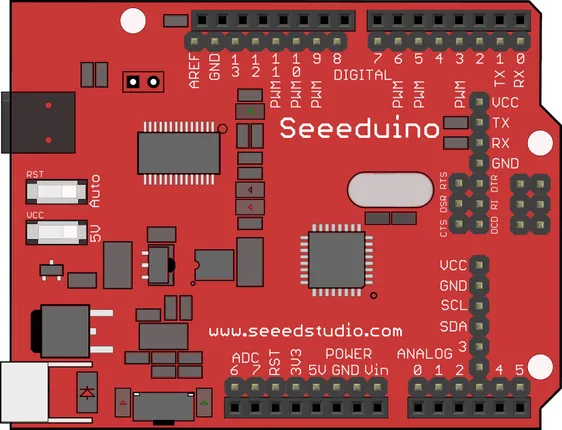

# Seeeduino V2.2

**Seeed Studio** · Other

Revision: Not identified  
Coverage: Pinout image collected

[Browse all manufacturers](../../../../BROWSE.md) · [Desktop app](https://github.com/valleytechsolutions/black-wire-desktop)

## Pinout

**pinout image** · Reviewed source · PNG

[Open original reference](../../../../library/media/715bdfd8cb00e09fad77dd4b5a554a343d0d2029ff205700db5f0759ccc5cb7e.png)

**Credit and rights:** Not established; source attribution retained. Source/manufacturer: Seeed Studio.

[Source 1](https://files.seeedstudio.com/wiki/Seeeduino_V2.2/img/Seeeduino_fritzing.png) · [Source 2](https://wiki.seeedstudio.com/Seeeduino_V2.2/)

Imported from existing Seeed Studio Board Reference; original working path preserved.

SHA-256: `715bdfd8cb00e09fad77dd4b5a554a343d0d2029ff205700db5f0759ccc5cb7e`

Pin assignments have not been independently electrically verified. Check board revision before wiring.
