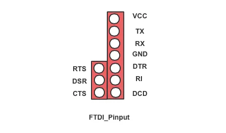
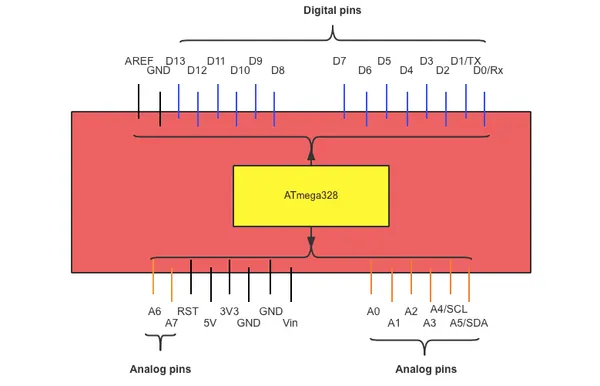
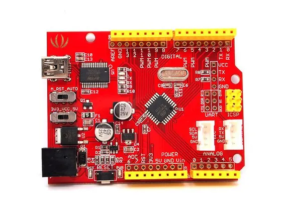
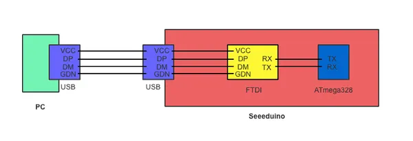

# Seeeduino V3.0

**Seeed Studio** · Other

Revision: Multiple source/revision records; see individual assets  
Coverage: Pinout image collected

[Browse all manufacturers](../../../../BROWSE.md) · [Desktop app](https://github.com/valleytechsolutions/black-wire-desktop)

## Pinout (UART Header)

**pinout image** · Reviewed source · PNG

[Open original reference](../../../../library/media/e7bb4fb696d7204f32513b8fc4517b205003729ecb1f55331829d25366139b43.png)

**Credit and rights:** Not established; source attribution retained. Source/manufacturer: Seeed Studio.

[Source 1](https://files.seeedstudio.com/wiki/Seeeduino-v3.0/img/Seeeduino_FTDI_pinout.png) · [Source 2](https://wiki.seeedstudio.com/Seeeduino_v3.0/)

Imported from existing Seeed Studio Board Reference; original working path preserved. Only the named connector or subsection is covered.

**Partial diagram. Confirm missing pins against the exact board documentation.**

SHA-256: `e7bb4fb696d7204f32513b8fc4517b205003729ecb1f55331829d25366139b43`

## Pinout

**pinout image** · Reviewed source · PNG

[Open original reference](../../../../library/media/2e7cbf23d7e15fc62b602eb3e88d6168481fa980009701f61133e84e653395a6.png)

**Credit and rights:** Not established; source attribution retained. Source/manufacturer: Seeed Studio.

[Source 1](https://files.seeedstudio.com/wiki/Seeeduino-v3.0/img/Seeeduino_pinout.png) · [Source 2](https://wiki.seeedstudio.com/Seeeduino_v3.0/)

Imported from existing Seeed Studio Board Reference; original working path preserved.

SHA-256: `2e7cbf23d7e15fc62b602eb3e88d6168481fa980009701f61133e84e653395a6`

## Pinout (V3.0)

**board labeling image** · Reviewed source · JPG

[Open original reference](../../../../library/media/2fc416bcfc8ad9378e52156269a271b49d7370ca0107392863bac773c774bf2d.jpg)

**Credit and rights:** Not established; source attribution retained. Source/manufacturer: Seeed Studio.

[Source 1](https://files.seeedstudio.com/wiki/Seeeduino/img/Seeeduino_V3.0_Atmega_328P_01.jpg) · [Source 2](https://wiki.seeedstudio.com/Seeeduino/)

Imported from existing Seeed Studio Board Reference; original working path preserved.

SHA-256: `2fc416bcfc8ad9378e52156269a271b49d7370ca0107392863bac773c774bf2d`

## Block Diagram (USB-to-Serial)

**source reference** · Unreviewed source · PNG

[Open original reference](../../../../library/media/776618f332b7794c7831c42f3247d7676fe85d37335c776d2a355211b323ea89.png)

**Credit and rights:** Source rights not yet established. Source/manufacturer: Seeed Studio.

[Source 1](https://files.seeedstudio.com/wiki/Seeeduino-v3.0/img/Seeeduino_FTDI.png) · [Source 2](https://wiki.seeedstudio.com/Seeeduino_v3.0/)

Original source index: Block Diagram (USB-to-Serial). This file is searchable but has not been promoted to a reviewed physical board pinout.

SHA-256: `776618f332b7794c7831c42f3247d7676fe85d37335c776d2a355211b323ea89`

Pin assignments have not been independently electrically verified. Check board revision before wiring.
