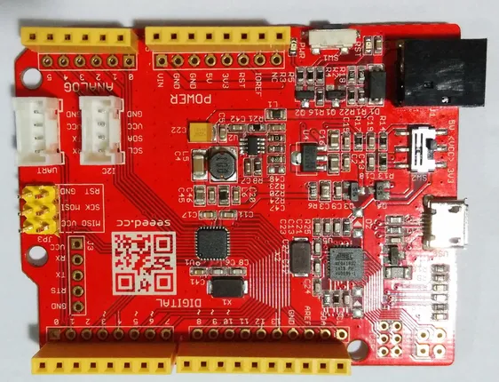

# Seeeduino V4

**Seeed Studio** · Other

Revision: V4, source label  
Coverage: Board labels only; pinout needed

[Browse all manufacturers](../../../../BROWSE.md) · [Desktop app](https://github.com/valleytechsolutions/black-wire-desktop)

## Pinout (V4)

**board labeling image** · Reviewed source · JPG

[Open original reference](../../../../library/media/79d8e32c05ee107fc3ad8622760e12bb550d46e6eb68fcdcd0e7e570b449ba15.jpg)

**Credit and rights:** Not established; source attribution retained. Source/manufacturer: Seeed Studio.

[Source 1](https://files.seeedstudio.com/wiki/Seeeduino/img/Seeeduino_v4_photo.jpg) · [Source 2](https://wiki.seeedstudio.com/Seeeduino/)

Imported from existing Seeed Studio Board Reference; original working path preserved.

SHA-256: `79d8e32c05ee107fc3ad8622760e12bb550d46e6eb68fcdcd0e7e570b449ba15`

Pin assignments have not been independently electrically verified. Check board revision before wiring.
