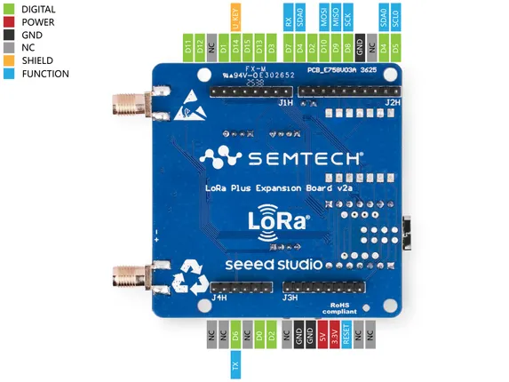
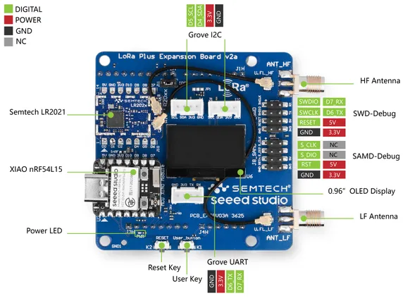

# Semtech LR2021 LoRa Plus Evaluation Kit

**Seeed Studio** · Other

Revision: Not identified  
Coverage: Pinout image collected

[Browse all manufacturers](../../../../BROWSE.md) · [Desktop app](https://github.com/valleytechsolutions/black-wire-desktop)

## Pinout (Back)

**pinout image** · Reviewed source · JPG

[Open original reference](../../../../library/media/588edca11794179df57e957e4db99c1493d2d147d4114484f3ca4368636678f7.jpg)

**Credit and rights:** Not established; source attribution retained. Source/manufacturer: Seeed Studio.

[Source 1](https://files.seeedstudio.com/wiki/Semtech_LR2021_EVK/image/100039980-LR2021-LoRa-Plus-Evaluation-kit-868Mhz-EU-V2.0-Pinout-Back.jpg) · [Source 2](https://wiki.seeedstudio.com/semtech_lr2021_evk_getting_started/)

Imported from existing Seeed Studio Board Reference; original working path preserved.

SHA-256: `588edca11794179df57e957e4db99c1493d2d147d4114484f3ca4368636678f7`

## Pinout (Front)

**pinout image** · Reviewed source · JPG

[Open original reference](../../../../library/media/779ccb267b99e70084ae856bc73c91bb6bce94585165a38e84648208e64d7207.jpg)

**Credit and rights:** Not established; source attribution retained. Source/manufacturer: Seeed Studio.

[Source 1](https://files.seeedstudio.com/wiki/Semtech_LR2021_EVK/image/100039980-LR2021-LoRa-Plus-Evaluation-kit-868Mhz-EU-V2.0-Pinout-Front.jpg) · [Source 2](https://wiki.seeedstudio.com/semtech_lr2021_evk_getting_started/)

Imported from existing Seeed Studio Board Reference; original working path preserved.

SHA-256: `779ccb267b99e70084ae856bc73c91bb6bce94585165a38e84648208e64d7207`

Pin assignments have not been independently electrically verified. Check board revision before wiring.
