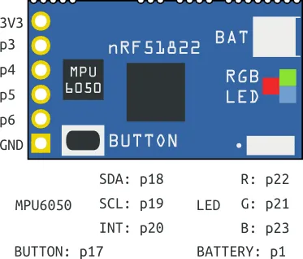
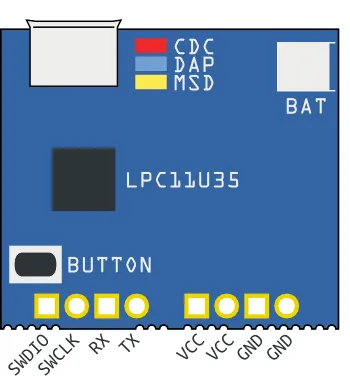

# Tiny BLE

**Seeed Studio** · Other

Revision: Not identified  
Coverage: Pinout image collected

[Browse all manufacturers](../../../../BROWSE.md) · [Desktop app](https://github.com/valleytechsolutions/black-wire-desktop)

## Pinout (BLE Board)

**pinout image** · Reviewed source · PNG

[Open original reference](../../../../library/media/2471d21a8b7610ab4ca4433f75eb3e29a3ac14060e5d682ee510beea0f64eb04.png)

**Credit and rights:** Not established; source attribution retained. Source/manufacturer: Seeed Studio.

[Source 1](https://files.seeedstudio.com/wiki/Tiny_BLE/img/Ble_smurfs_ble.png) · [Source 2](https://wiki.seeedstudio.com/Tiny_BLE/)

Imported from existing Seeed Studio Board Reference; original working path preserved.

SHA-256: `2471d21a8b7610ab4ca4433f75eb3e29a3ac14060e5d682ee510beea0f64eb04`

## Pinout (Interface Board)

**pinout image** · Reviewed source · PNG

[Open original reference](../../../../library/media/6b9812111bf31cd9dd12200ae5786ecdf7f0dc351ff28d506cc8b9c6040dc439.png)

**Credit and rights:** Not established; source attribution retained. Source/manufacturer: Seeed Studio.

[Source 1](https://files.seeedstudio.com/wiki/Tiny_BLE/img/Ble_smurfs_interface.png) · [Source 2](https://wiki.seeedstudio.com/Tiny_BLE/)

Imported from existing Seeed Studio Board Reference; original working path preserved.

SHA-256: `6b9812111bf31cd9dd12200ae5786ecdf7f0dc351ff28d506cc8b9c6040dc439`

Pin assignments have not been independently electrically verified. Check board revision before wiring.
