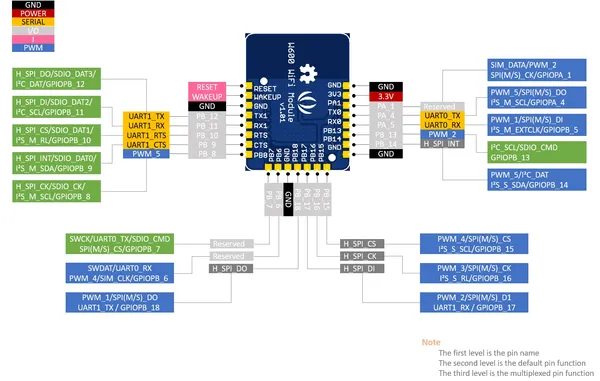
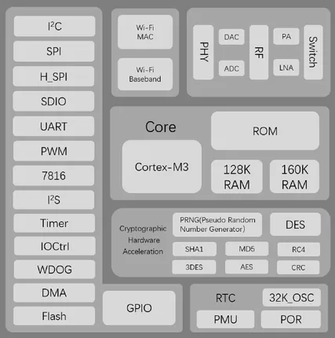

# W600 Module

**Seeed Studio** · Other

Revision: Not identified  
Coverage: Pinout image collected

[Browse all manufacturers](../../../../BROWSE.md) · [Desktop app](https://github.com/valleytechsolutions/black-wire-desktop)

## Pinout

**pinout image** · Reviewed source · JPG

[Open original reference](../../../../library/media/af9588b167f4d129c3231d6888a88e5946f36ca46f0a6160feaef09feae634b1.jpg)

**Credit and rights:** Not established; source attribution retained. Source/manufacturer: Seeed Studio.

[Source 1](https://files.seeedstudio.com/wiki/W600_Module/img/pinout_w600_module.jpg) · [Source 2](https://wiki.seeedstudio.com/W600_Module/)

Imported from existing Seeed Studio Board Reference; original working path preserved.

SHA-256: `af9588b167f4d129c3231d6888a88e5946f36ca46f0a6160feaef09feae634b1`

## Block Diagram

**source reference** · Unreviewed source · PNG

[Open original reference](../../../../library/media/9723479c39634d22c8a96e415cc74d4a14684ae98ca4d6dd1489844ef0c897a8.png)

**Credit and rights:** Source rights not yet established. Source/manufacturer: Seeed Studio.

[Source 1](https://files.seeedstudio.com/wiki/W600_Module/img/block.png) · [Source 2](https://wiki.seeedstudio.com/W600_Module/)

Original source index: Block Diagram. This file is searchable but has not been promoted to a reviewed physical board pinout.

SHA-256: `9723479c39634d22c8a96e415cc74d4a14684ae98ca4d6dd1489844ef0c897a8`

Pin assignments have not been independently electrically verified. Check board revision before wiring.
