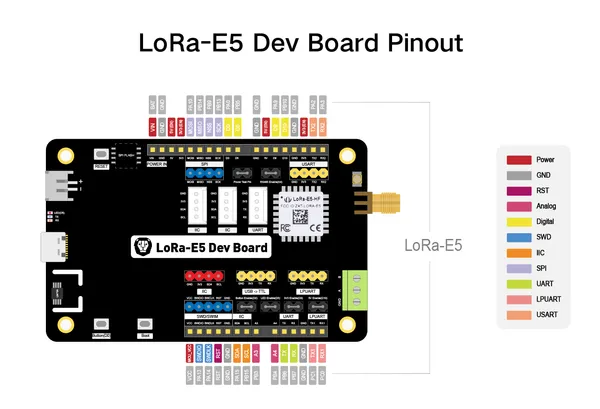
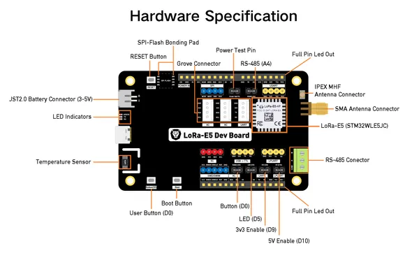

# Wio-E5 Development Kit

**Seeed Studio** · Other

Revision: Not identified  
Coverage: Pinout image collected

[Browse all manufacturers](../../../../BROWSE.md) · [Desktop app](https://github.com/valleytechsolutions/black-wire-desktop)

## Pinout

**pinout image** · Reviewed source · PNG

[Open original reference](../../../../library/media/99b25bf0f6de8bed630cbb857eb8d1b29e73daa0b22d7fa8a5df1e5dce93f22e.png)

**Credit and rights:** Not established; source attribution retained. Source/manufacturer: Seeed Studio.

[Source 1](https://files.seeedstudio.com/wiki/LoRa-E5_Development_Kit/3011615286741_.pic_hd.jpg) · [Source 2](https://wiki.seeedstudio.com/LoRa_E5_Dev_Board/)

Imported from existing Seeed Studio Board Reference; original working path preserved.

SHA-256: `99b25bf0f6de8bed630cbb857eb8d1b29e73daa0b22d7fa8a5df1e5dce93f22e`

## Hardware Overview

**source reference** · Unreviewed source · PNG

[Open original reference](../../../../library/media/adbae905aff0ec77a660de67cfb522deb2bf01a5513f9618c6a109ba8bb56ab4.png)

**Credit and rights:** Source rights not yet established. Source/manufacturer: Seeed Studio.

[Source 1](https://files.seeedstudio.com/wiki/LoRa-E5_Development_Kit/hardware%20overview/4071615359366_.pic_hd.jpg) · [Source 2](https://wiki.seeedstudio.com/LoRa_E5_Dev_Board/)

Original source index: Hardware Overview. This file is searchable but has not been promoted to a reviewed physical board pinout.

SHA-256: `adbae905aff0ec77a660de67cfb522deb2bf01a5513f9618c6a109ba8bb56ab4`

Pin assignments have not been independently electrically verified. Check board revision before wiring.
