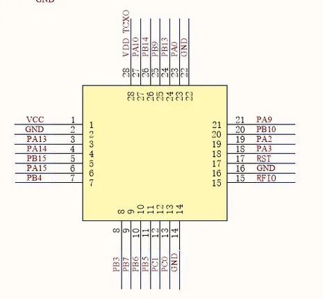

# Wio-E5 STM32WLE5JC Module

**Seeed Studio** · Other

Revision: Not identified  
Coverage: GPIO reference collected; physical pinout needed

[Browse all manufacturers](../../../../BROWSE.md) · [Desktop app](https://github.com/valleytechsolutions/black-wire-desktop)

## Pinout

**GPIO reference image** · Reviewed source · JPG

[Open original reference](../../../../library/media/74a368b9bc8b7836d9d9aaed0b4be0b2e4d0d885b17d1e72ad60d4079911a763.jpg)

**Credit and rights:** Not established; source attribution retained. Source/manufacturer: Seeed Studio.

[Source 1](https://files.seeedstudio.com/products/317990687/image/pin.jpg) · [Source 2](https://wiki.seeedstudio.com/LoRa-E5_STM32WLE5JC_Module/)

Module schematic symbol; not a physical module pad map. Imported from existing Seeed Studio Board Reference; original working path preserved.

SHA-256: `74a368b9bc8b7836d9d9aaed0b4be0b2e4d0d885b17d1e72ad60d4079911a763`

Pin assignments have not been independently electrically verified. Check board revision before wiring.
