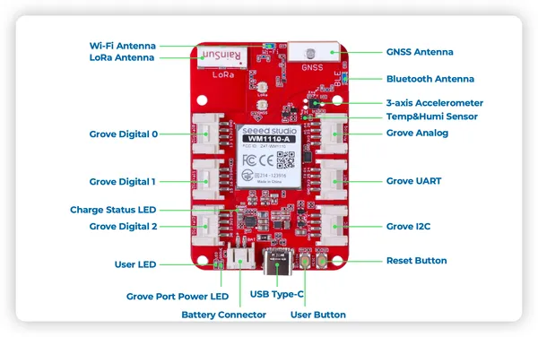

# Wio Tracker 1110 Dev Board

**Seeed Studio** · Other

Revision: Not identified  
Coverage: Pinout image collected

[Browse all manufacturers](../../../../BROWSE.md) · [Devices & IoT](../../../../DEVICES.md) · [Open in the browser guide](https://valleytech-black-wire-guide.pages.dev/?board=seeed-studio-other-wio-tracker-1110-dev-board)

Device category: **Radios & GNSS**

## Pinout

**pinout image** · Reviewed source · PNG

[Open original reference](../../../../library/media/30ba5d2c3d69f202565441460dea30e59aff5a8623bcb9b299a957a43611e21e.png)

**Credit and rights:** Not established; source attribution retained. Source/manufacturer: Seeed Studio.

[Source 1](https://files.seeedstudio.com/wiki/SenseCAP/wio_tracker/wio-tracker-grove.png) · [Source 2](https://wiki.seeedstudio.com/development_tutorial_for_Wio-trakcer/)

Imported from existing Seeed Studio Board Reference; original working path preserved.

Image revision: Not identified

SHA-256: `30ba5d2c3d69f202565441460dea30e59aff5a8623bcb9b299a957a43611e21e`

## Hardware Overview

**source reference** · Unreviewed source · PNG

[Open original reference](../../../../library/media/b72b4e50788029c5d956753b547dd11adb33615c34f82cd6ce792e8e71d50aeb.png)

**Credit and rights:** Source rights not yet established. Source/manufacturer: Seeed Studio.

[Source 1](https://files.seeedstudio.com/wiki/SenseCAP/wio_tracker/hard-overview.png) · [Source 2](https://wiki.seeedstudio.com/Wio-Tracker_Introduction/)

Original source index: Hardware Overview. This file is searchable but has not been promoted to a reviewed physical board pinout.

Image revision: Not identified

SHA-256: `b72b4e50788029c5d956753b547dd11adb33615c34f82cd6ce792e8e71d50aeb`

Pin assignments have not been independently electrically verified. Check board revision before wiring.
