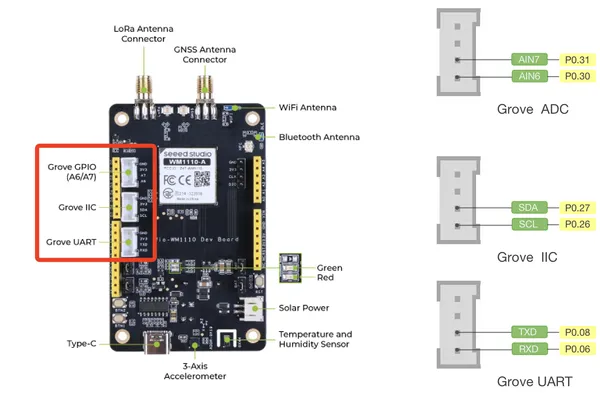
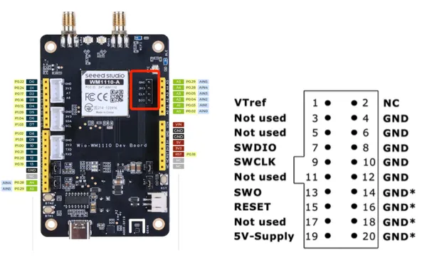
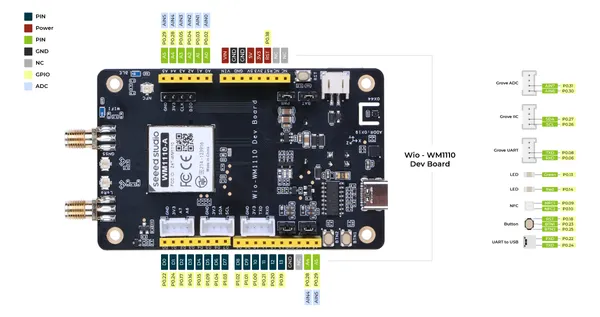
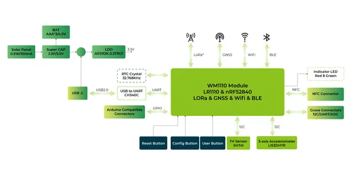
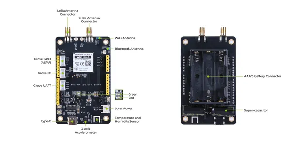

# Wio-WM1110 Dev Kit

**Seeed Studio** · Other

Revision: Not identified  
Coverage: Pinout image collected

[Browse all manufacturers](../../../../BROWSE.md) · [Desktop app](https://github.com/valleytechsolutions/black-wire-desktop)

## Pinout (Grove)

**pinout image** · Reviewed source · PNG

[Open original reference](../../../../library/media/8ade6f54f6772ec1850034e4ee114f850b2312adc60810fd267383ed47bb438c.png)

**Credit and rights:** Not established; source attribution retained. Source/manufacturer: Seeed Studio.

[Source 1](https://files.seeedstudio.com/wiki/SenseCAP/Wio-WM1110%20Dev%20Kit/grove_pins.png) · [Source 2](https://wiki.seeedstudio.com/Wio-WM1110_Dev_Kit_Hardware_Overview/)

Imported from existing Seeed Studio Board Reference; original working path preserved. Only the named connector or subsection is covered.

**Partial diagram. Confirm missing pins against the exact board documentation.**

SHA-256: `8ade6f54f6772ec1850034e4ee114f850b2312adc60810fd267383ed47bb438c`

## Pinout (SWD)

**pinout image** · Reviewed source · PNG

[Open original reference](../../../../library/media/982a24d8d9dd5eaea5f321006dcaae8d9c47125cc25038e7793fae4dc706069c.png)

**Credit and rights:** Not established; source attribution retained. Source/manufacturer: Seeed Studio.

[Source 1](https://files.seeedstudio.com/wiki/SenseCAP/Wio-WM1110%20Dev%20Kit/hardware_connection.png) · [Source 2](https://wiki.seeedstudio.com/Get_Started_with_Wio-WM1110_Dev_Kit/)

Imported from existing Seeed Studio Board Reference; original working path preserved. Only the named connector or subsection is covered.

**Partial diagram. Confirm missing pins against the exact board documentation.**

SHA-256: `982a24d8d9dd5eaea5f321006dcaae8d9c47125cc25038e7793fae4dc706069c`

## Pinout

**pinout image** · Reviewed source · PNG

[Open original reference](../../../../library/media/eb25883a79ae70014b0744c1fde51e4238eccf6376dfdf9d4965f9bdf1b0131f.png)

**Credit and rights:** Not established; source attribution retained. Source/manufacturer: Seeed Studio.

[Source 1](https://files.seeedstudio.com/wiki/SenseCAP/Wio-WM1110%20Dev%20Kit/PIN.png) · [Source 2](https://wiki.seeedstudio.com/Wio-WM1110_Dev_Kit_Hardware_Overview/)

Imported from existing Seeed Studio Board Reference; original working path preserved.

SHA-256: `eb25883a79ae70014b0744c1fde51e4238eccf6376dfdf9d4965f9bdf1b0131f`

## Block Diagram

**source reference** · Unreviewed source · PNG

[Open original reference](../../../../library/media/8fdaa3b1025aa5cf9725ba1ec3243f7ca833597bcc3cedb0c14d93e743d701e0.png)

**Credit and rights:** Source rights not yet established. Source/manufacturer: Seeed Studio.

[Source 1](https://files.seeedstudio.com/wiki/SenseCAP/Wio-WM1110%20Dev%20Kit/schematic_1.png) · [Source 2](https://wiki.seeedstudio.com/Wio-WM1110_Dev_Kit/Introduction/)

Original source index: Block Diagram. This file is searchable but has not been promoted to a reviewed physical board pinout.

SHA-256: `8fdaa3b1025aa5cf9725ba1ec3243f7ca833597bcc3cedb0c14d93e743d701e0`

## Hardware Overview

**source reference** · Unreviewed source · PNG

[Open original reference](../../../../library/media/5b65aa8460d7c2add7c6455bdc3de572528f86365270bf8758c3eb67bf2655ff.png)

**Credit and rights:** Source rights not yet established. Source/manufacturer: Seeed Studio.

[Source 1](https://files.seeedstudio.com/wiki/SenseCAP/Wio-WM1110%20Dev%20Kit/hardware_overview1.png) · [Source 2](https://wiki.seeedstudio.com/Wio-WM1110_Dev_Kit_Hardware_Overview/)

Original source index: Hardware Overview. This file is searchable but has not been promoted to a reviewed physical board pinout.

SHA-256: `5b65aa8460d7c2add7c6455bdc3de572528f86365270bf8758c3eb67bf2655ff`

Pin assignments have not been independently electrically verified. Check board revision before wiring.
