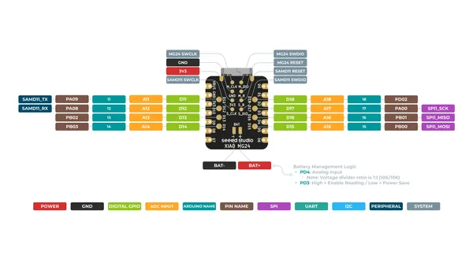
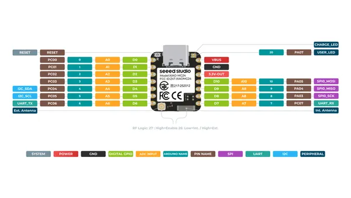

# XIAO MG24

**Seeed Studio** · Other

Revision: Not identified  
Coverage: Pinout image collected

[Browse all manufacturers](../../../../BROWSE.md) · [Desktop app](https://github.com/valleytechsolutions/black-wire-desktop)

## Pinout (Back)

**pinout image** · Reviewed source · PNG

[Open original reference](../../../../library/media/0c147fe8ead53d7ed8bd1911e1d724fefd833a7603e6f690c83ad093ccf6b47f.png)

**Credit and rights:** Not established; source attribution retained. Source/manufacturer: Seeed Studio.

[Source 1](https://files.seeedstudio.com/wiki/XIAO_MG24/Getting_Start/XIAO_MG24_back_pinout.png) · [Source 2](https://wiki.seeedstudio.com/xiao_mg24_getting_started/)

SHA-256: `0c147fe8ead53d7ed8bd1911e1d724fefd833a7603e6f690c83ad093ccf6b47f`

## Pinout (Front)

**pinout image** · Reviewed source · PNG

[Open original reference](../../../../library/media/0fe35f65de0b0529b3561c80d8d3f2230d5fbad7f59b8a665de4c8882fc2d1f0.png)

**Credit and rights:** Not established; source attribution retained. Source/manufacturer: Seeed Studio.

[Source 1](https://files.seeedstudio.com/wiki/XIAO_MG24/Getting_Start/XIAO_MG24_front_pinout.png) · [Source 2](https://wiki.seeedstudio.com/xiao_mg24_getting_started/)

SHA-256: `0fe35f65de0b0529b3561c80d8d3f2230d5fbad7f59b8a665de4c8882fc2d1f0`

Pin assignments have not been independently electrically verified. Check board revision before wiring.
