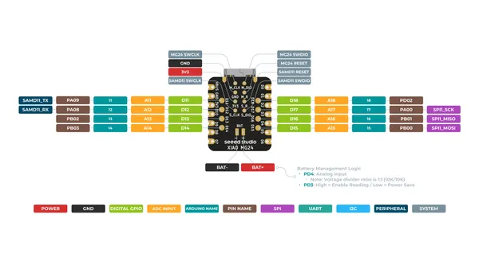
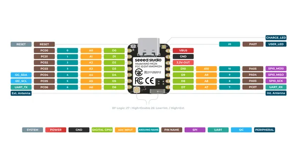

# XIAO MG24

**Seeed Studio** · Other

Revision: Not identified

Coverage: Pinout image collected

[Browse all manufacturers](../../../../BROWSE.md) · [Devices & IoT](../../../../DEVICES.md) · [Open in the browser guide](https://valleytech-black-wire-guide.pages.dev/?board=seeed-studio-other-xiao-mg24)

## Datasheets and original documentation

Board datasheet: **not yet recorded**. Visual reference: **available**.

[Manufacturer source (recorded link)](https://wiki.seeedstudio.com/xiao_mg24_getting_started/)

A chip datasheet, schematic and board datasheet have different scopes. Match the exact hardware revision.

[Documentation coverage and remaining gaps](../../../../DOCUMENTATION.md)

## Pinout (Back)

**pinout image** · Reviewed source · PNG

[Open original reference](../../../../library/media/0c147fe8ead53d7ed8bd1911e1d724fefd833a7603e6f690c83ad093ccf6b47f.png)

**Credit and rights:** Not established; source attribution retained. Source/manufacturer: Seeed Studio.

[Source 1](https://files.seeedstudio.com/wiki/XIAO_MG24/Getting_Start/XIAO_MG24_back_pinout.png) · [Source 2](https://wiki.seeedstudio.com/xiao_mg24_getting_started/)

Image revision: Not identified

SHA-256: `0c147fe8ead53d7ed8bd1911e1d724fefd833a7603e6f690c83ad093ccf6b47f`

## Pinout (Front)

**pinout image** · Reviewed source · PNG

[Open original reference](../../../../library/media/0fe35f65de0b0529b3561c80d8d3f2230d5fbad7f59b8a665de4c8882fc2d1f0.png)

**Credit and rights:** Not established; source attribution retained. Source/manufacturer: Seeed Studio.

[Source 1](https://files.seeedstudio.com/wiki/XIAO_MG24/Getting_Start/XIAO_MG24_front_pinout.png) · [Source 2](https://wiki.seeedstudio.com/xiao_mg24_getting_started/)

Image revision: Not identified

SHA-256: `0fe35f65de0b0529b3561c80d8d3f2230d5fbad7f59b8a665de4c8882fc2d1f0`

Pin assignments have not been independently electrically verified. Check board revision before wiring.
