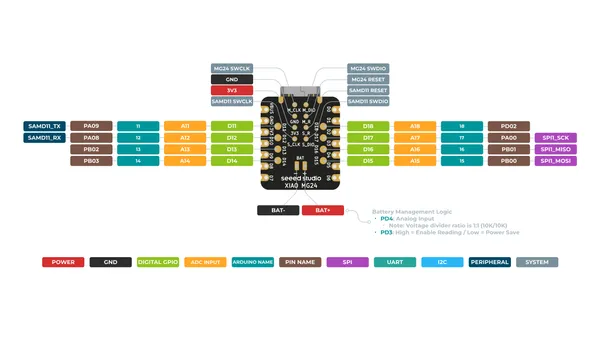
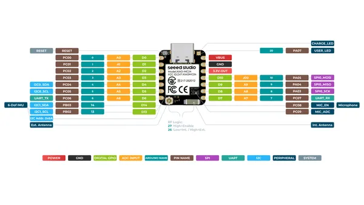

# XIAO MG24 Sense

**Seeed Studio** · Other

Revision: Not identified  
Coverage: Pinout image collected

[Browse all manufacturers](../../../../BROWSE.md) · [Desktop app](https://github.com/valleytechsolutions/black-wire-desktop)

## Pinout (Back)

**pinout image** · Reviewed source · PNG

[Open original reference](../../../../library/media/9380b68e16fc9725d238f094dd8b0ba394bb4724eb68efc87ce797224cde5659.png)

**Credit and rights:** Not established; source attribution retained. Source/manufacturer: Seeed Studio.

[Source 1](https://files.seeedstudio.com/wiki/XIAO_MG24/Getting_Start/XIAO_MG24_Sense_back_pinout.png) · [Source 2](https://wiki.seeedstudio.com/xiao_mg24_getting_started/)

SHA-256: `9380b68e16fc9725d238f094dd8b0ba394bb4724eb68efc87ce797224cde5659`

## Pinout (Front)

**pinout image** · Reviewed source · PNG

[Open original reference](../../../../library/media/ea8361252836b753020fd1f7a811851c25ccb3f46de577554247561ac312fe3b.png)

**Credit and rights:** Not established; source attribution retained. Source/manufacturer: Seeed Studio.

[Source 1](https://files.seeedstudio.com/wiki/XIAO_MG24/Getting_Start/XIAO_MG24_Sense_front_pinout.png) · [Source 2](https://wiki.seeedstudio.com/xiao_mg24_getting_started/)

SHA-256: `ea8361252836b753020fd1f7a811851c25ccb3f46de577554247561ac312fe3b`

Pin assignments have not been independently electrically verified. Check board revision before wiring.
