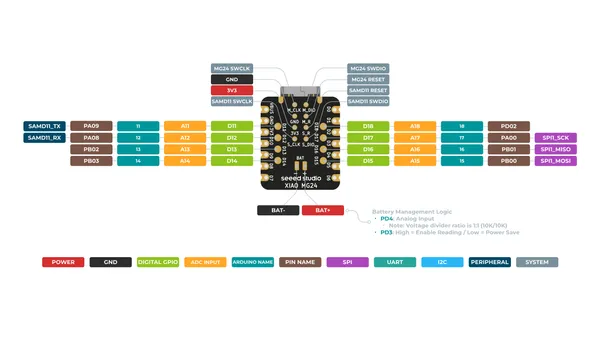
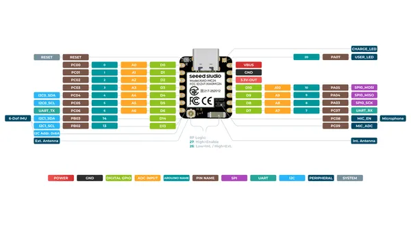
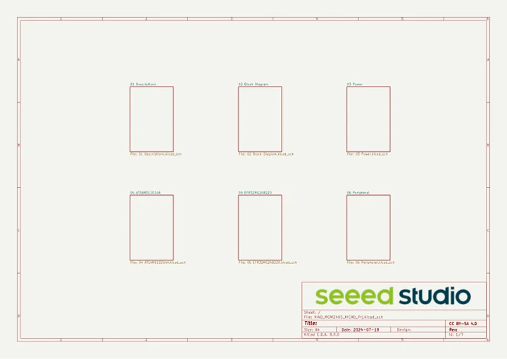

# XIAO MG24 Sense

**Seeed Studio** · Other

Revision: Not identified

Coverage: Manufacturer references reviewed by scope; independent electrical and all-connector review pending

[Browse all manufacturers](../../../../BROWSE.md) · [Devices & IoT](../../../../DEVICES.md) · [Open in the browser guide](https://valleytech-black-wire-guide.pages.dev/?board=seeed-studio-other-xiao-mg24-sense)

## Datasheets and original documentation

Board datasheet: **not yet recorded**. Visual reference: **available**.

[Manufacturer hardware documentation](https://wiki.seeedstudio.com/xiao_mg24_getting_started/)

- **schematic / board**: [XIAO MG24 Sense Schematic](https://files.seeedstudio.com/wiki/XIAO_MG24/Getting_Start/XIAO_MGM240S_KICAD_Prj.pdf) · [saved document](../../../../library/media/9061b13e67add7d567629a264517d04af2dfa71df156d3e27b188f21becc088f.pdf)
- **hardware-guide / board**: [Manufacturer pin and hardware documentation](https://wiki.seeedstudio.com/xiao_mg24_getting_started/) · online

A chip datasheet, schematic and board datasheet have different scopes. Match the exact hardware revision.

[Documentation coverage and remaining gaps](../../../../DOCUMENTATION.md)

## Pinout (Back)

**pinout image** · Reviewed source · PNG

[Open original reference](../../../../library/media/9380b68e16fc9725d238f094dd8b0ba394bb4724eb68efc87ce797224cde5659.png)

**Credit and rights:** Not established; source attribution retained. Source/manufacturer: Seeed Studio.

[Source 1](https://files.seeedstudio.com/wiki/XIAO_MG24/Getting_Start/XIAO_MG24_Sense_back_pinout.png) · [Source 2](https://wiki.seeedstudio.com/xiao_mg24_getting_started/)

Image revision: Not identified

SHA-256: `9380b68e16fc9725d238f094dd8b0ba394bb4724eb68efc87ce797224cde5659`

## Pinout (Front)

**pinout image** · Reviewed source · PNG

[Open original reference](../../../../library/media/ea8361252836b753020fd1f7a811851c25ccb3f46de577554247561ac312fe3b.png)

**Credit and rights:** Not established; source attribution retained. Source/manufacturer: Seeed Studio.

[Source 1](https://files.seeedstudio.com/wiki/XIAO_MG24/Getting_Start/XIAO_MG24_Sense_front_pinout.png) · [Source 2](https://wiki.seeedstudio.com/xiao_mg24_getting_started/)

Image revision: Not identified

SHA-256: `ea8361252836b753020fd1f7a811851c25ccb3f46de577554247561ac312fe3b`

## XIAO MG24 Sense Schematic

**original reference PDF** · Source identity and visual scope inspected; PDF review covers first-page preview. Independent electrical and all-connector completeness review pending. · PDF

[Open original reference](../../../../library/media/9061b13e67add7d567629a264517d04af2dfa71df156d3e27b188f21becc088f.pdf)

**Credit and rights:** Manufacturer artwork; reuse and print rights not established. Inclusion does not relicense the original.. Source/manufacturer: Seeed Studio.

[Source 1](https://files.seeedstudio.com/wiki/XIAO_MG24/Getting_Start/XIAO_MGM240S_KICAD_Prj.pdf) · [Source 2](https://wiki.seeedstudio.com/xiao_mg24_getting_started/)

Manufacturer source retained unchanged. Source identity and visual scope inspected; PDF review covers first-page preview. Independent electrical and all-connector completeness review pending.

Image revision: As supplied in the original; match exact board revision

SHA-256: `9061b13e67add7d567629a264517d04af2dfa71df156d3e27b188f21becc088f`

Pin assignments have not been independently electrically verified. Check board revision before wiring.
