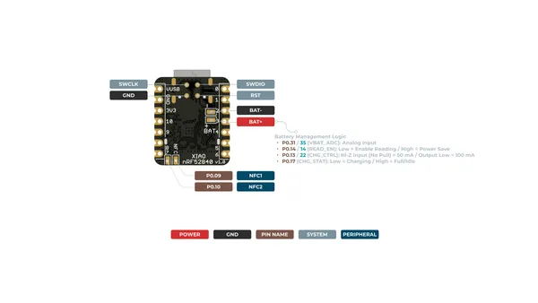
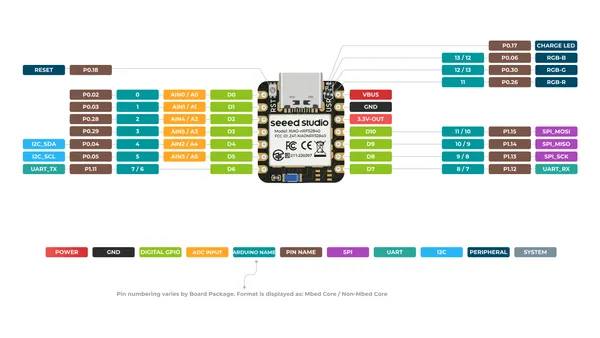
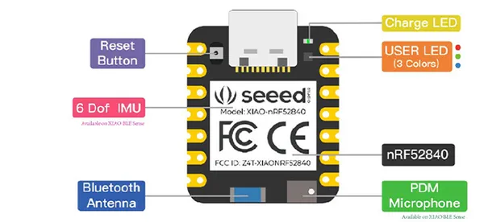
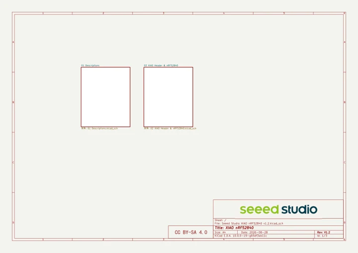

# XIAO nRF52840

**Seeed Studio** · Other

Revision: Not identified

Coverage: Manufacturer references reviewed by scope; independent electrical and all-connector review pending

[Browse all manufacturers](../../../../BROWSE.md) · [Devices & IoT](../../../../DEVICES.md) · [Open in the browser guide](https://valleytech-black-wire-guide.pages.dev/?board=seeed-studio-other-xiao-nrf52840)

## Datasheets and original documentation

Board datasheet: **not yet recorded**. Visual reference: **available**.

[Manufacturer hardware documentation](https://wiki.seeedstudio.com/XIAO_BLE/)

- **schematic / board**: [XIAO nRF52840 Schematic](https://files.seeedstudio.com/wiki/XIAO-BLE/Res/260828_XIAO_nRF52840.pdf) · [saved document](../../../../library/media/b2a1921c2a67e94996662a3348046ae6c35cb7e36f434d4e5036d018fc4d1cd7.pdf)
- **hardware-guide / board**: [Manufacturer pin and hardware documentation](https://wiki.seeedstudio.com/XIAO_BLE/) · online

A chip datasheet, schematic and board datasheet have different scopes. Match the exact hardware revision.

[Documentation coverage and remaining gaps](../../../../DOCUMENTATION.md)

## Pinout (Back)

**pinout image** · Reviewed source · PNG

[Open original reference](../../../../library/media/133fe82ccbffbe936e74fc1a161b96d696732770fc5f878c353f4ca36cbe6bdc.png)

**Credit and rights:** Not established; source attribution retained. Source/manufacturer: Seeed Studio.

[Source 1](https://files.seeedstudio.com/wiki/XIAO-BLE/XIAO_nRF52840_back_pinout.png) · [Source 2](https://wiki.seeedstudio.com/XIAO_BLE/)

Image revision: Not identified

SHA-256: `133fe82ccbffbe936e74fc1a161b96d696732770fc5f878c353f4ca36cbe6bdc`

## Pinout (Front)

**pinout image** · Reviewed source · PNG

[Open original reference](../../../../library/media/882afd8628bf0c2dd651a45d94055d4782af41639eaee6e7f95eff6e47ea267e.png)

**Credit and rights:** Not established; source attribution retained. Source/manufacturer: Seeed Studio.

[Source 1](https://files.seeedstudio.com/wiki/XIAO-BLE/XIAO_nRF52840_front_pinout.png) · [Source 2](https://wiki.seeedstudio.com/XIAO_BLE/)

Image revision: Not identified

SHA-256: `882afd8628bf0c2dd651a45d94055d4782af41639eaee6e7f95eff6e47ea267e`

## Hardware Overview

**source reference** · Unreviewed source · PNG

[Open original reference](../../../../library/media/e26b9366ea200fd2db4c42a3b16c04cdfa3187b748fbe4a52e8222abc004eae6.png)

**Credit and rights:** Source rights not yet established. Source/manufacturer: Seeed Studio.

[Source 1](https://files.seeedstudio.com/wiki/microblocks/xiao-nrf52-sense.png) · [Source 2](https://wiki.seeedstudio.com/xiao_ble_microblocks/)

Original source index: Hardware Overview. This file is searchable but has not been promoted to a reviewed physical board pinout.

Image revision: Not identified

SHA-256: `e26b9366ea200fd2db4c42a3b16c04cdfa3187b748fbe4a52e8222abc004eae6`

## Pinout Sheet

**source reference** · Unreviewed source · XLSX

[Open original reference](../../../../library/media/80474216968b5be5d9128cf55b6d9191fb53d4ae2bcde6f24131752da0ea3e94.xlsx)

**Credit and rights:** Source rights not yet established. Source/manufacturer: Seeed Studio.

[Source 1](https://files.seeedstudio.com/wiki/XIAO-BLE/XIAO-nRF52840-pinout_sheet.xlsx) · [Source 2](https://wiki.seeedstudio.com/XIAO_BLE/)

Original source index: Pinout Sheet. This file is searchable but has not been promoted to a reviewed physical board pinout.

Image revision: Not identified

SHA-256: `80474216968b5be5d9128cf55b6d9191fb53d4ae2bcde6f24131752da0ea3e94`

## XIAO nRF52840 Schematic

**original reference PDF** · Source identity and visual scope inspected; PDF review covers first-page preview. Independent electrical and all-connector completeness review pending. · PDF

[Open original reference](../../../../library/media/b2a1921c2a67e94996662a3348046ae6c35cb7e36f434d4e5036d018fc4d1cd7.pdf)

**Credit and rights:** Manufacturer artwork; reuse and print rights not established. Inclusion does not relicense the original.. Source/manufacturer: Seeed Studio.

[Source 1](https://files.seeedstudio.com/wiki/XIAO-BLE/Res/260828_XIAO_nRF52840.pdf) · [Source 2](https://wiki.seeedstudio.com/XIAO_BLE/)

Manufacturer source retained unchanged. Source identity and visual scope inspected; PDF review covers first-page preview. Independent electrical and all-connector completeness review pending.

Image revision: As supplied in the original; match exact board revision

SHA-256: `b2a1921c2a67e94996662a3348046ae6c35cb7e36f434d4e5036d018fc4d1cd7`

Pin assignments have not been independently electrically verified. Check board revision before wiring.
