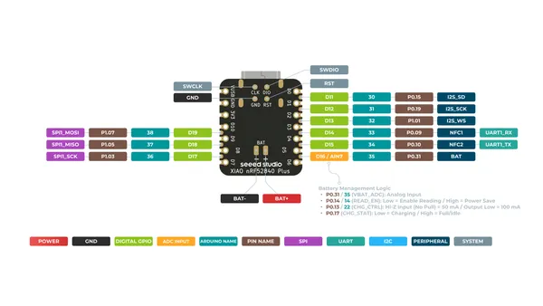
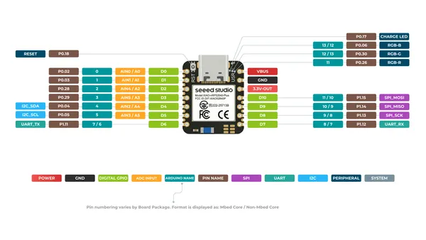

# XIAO nRF52840 Plus

**Seeed Studio** · Other

Revision: Not identified  
Coverage: Pinout image collected

[Browse all manufacturers](../../../../BROWSE.md) · [Desktop app](https://github.com/valleytechsolutions/black-wire-desktop)

## Pinout (Back)

**pinout image** · Reviewed source · PNG

[Open original reference](../../../../library/media/35fedfc740b6741e094af38e5bea6de94215c63894c36593ac815d7ca770ff9a.png)

**Credit and rights:** Not established; source attribution retained. Source/manufacturer: Seeed Studio.

[Source 1](https://files.seeedstudio.com/wiki/XIAO-BLE/XIAO_nRF52840_Plus_back_pinout.png) · [Source 2](https://wiki.seeedstudio.com/XIAO_BLE/)

SHA-256: `35fedfc740b6741e094af38e5bea6de94215c63894c36593ac815d7ca770ff9a`

## Pinout (Front)

**pinout image** · Reviewed source · PNG

[Open original reference](../../../../library/media/b6c7843a4a99a7cfe9b2f41614cdd8f384ac0b5d24c3a5457873065de67ca418.png)

**Credit and rights:** Not established; source attribution retained. Source/manufacturer: Seeed Studio.

[Source 1](https://files.seeedstudio.com/wiki/XIAO-BLE/XIAO_nRF52840_Plus_front_pinout.png) · [Source 2](https://wiki.seeedstudio.com/XIAO_BLE/)

SHA-256: `b6c7843a4a99a7cfe9b2f41614cdd8f384ac0b5d24c3a5457873065de67ca418`

Pin assignments have not been independently electrically verified. Check board revision before wiring.
