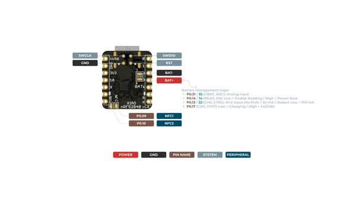
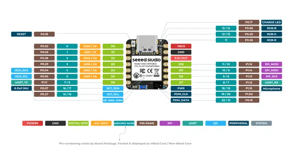
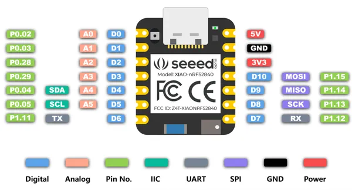
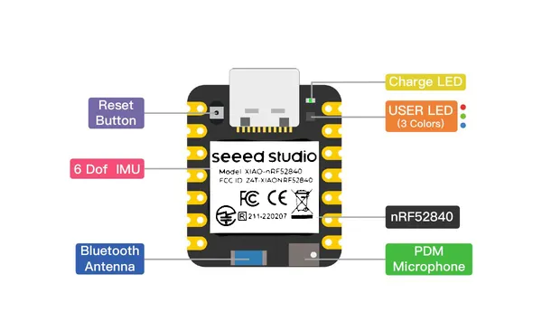

# XIAO nRF52840 Sense

**Seeed Studio** · Other

Revision: Not identified  
Coverage: Pinout image collected

[Browse all manufacturers](../../../../BROWSE.md) · [Desktop app](https://github.com/valleytechsolutions/black-wire-desktop)

## Pinout (Back)

**pinout image** · Reviewed source · PNG

[Open original reference](../../../../library/media/3f6ca7b680a00a86f14969f55e7d1c62e816f665c90a3e4ba8b9467321c1b318.png)

**Credit and rights:** Not established; source attribution retained. Source/manufacturer: Seeed Studio.

[Source 1](https://files.seeedstudio.com/wiki/XIAO-BLE/XIAO_nRF52840_Sense_back_pinout.png) · [Source 2](https://wiki.seeedstudio.com/XIAO_BLE/)

SHA-256: `3f6ca7b680a00a86f14969f55e7d1c62e816f665c90a3e4ba8b9467321c1b318`

## Pinout (Front)

**pinout image** · Reviewed source · PNG

[Open original reference](../../../../library/media/fac150803903d22c339587cb693d4ccba3c93d9260df920debca99cdd5eab26e.png)

**Credit and rights:** Not established; source attribution retained. Source/manufacturer: Seeed Studio.

[Source 1](https://files.seeedstudio.com/wiki/XIAO-BLE/XIAO_nRF52840_Sense_front_pinout.png) · [Source 2](https://wiki.seeedstudio.com/XIAO_BLE/)

SHA-256: `fac150803903d22c339587cb693d4ccba3c93d9260df920debca99cdd5eab26e`

## Pinout (Simplified)

**pinout image** · Reviewed source · PNG

[Open original reference](../../../../library/media/65d749d43440ba10b56fe3b19e67ad52cd959d6ef389c94d1b10965d6df9a837.png)

**Credit and rights:** Not established; source attribution retained. Source/manufacturer: Seeed Studio.

[Source 1](https://files.seeedstudio.com/wiki/XIAO-BLE/pinout2.png) · [Source 2](https://wiki.seeedstudio.com/XIAO-nRF52840-Zephyr-RTOS/)

SHA-256: `65d749d43440ba10b56fe3b19e67ad52cd959d6ef389c94d1b10965d6df9a837`

## Hardware Overview

**source reference** · Unreviewed source · PNG

[Open original reference](../../../../library/media/76ccb893856fbc2e938be7d424a674296820a4bb459d05154085f95914baf069.png)

**Credit and rights:** Source rights not yet established. Source/manufacturer: Seeed Studio.

[Source 1](https://files.seeedstudio.com/wiki/wiki-ranger/Contributions/BLE-PDM-TinyML/XIAO_nrf82840_hardware.png) · [Source 2](https://wiki.seeedstudio.com/XIAO-BLE-PDM-EI/)

Original source index: Hardware Overview. This file is searchable but has not been promoted to a reviewed physical board pinout.

SHA-256: `76ccb893856fbc2e938be7d424a674296820a4bb459d05154085f95914baf069`

## Pinout Sheet

**source reference** · Unreviewed source · XLSX

[Open original reference](../../../../library/media/5c528a22878e2db6c0903aa7cf908e764c24a4413b8f4c3de8cd133de7cb131b.xlsx)

**Credit and rights:** Source rights not yet established. Source/manufacturer: Seeed Studio.

[Source 1](https://files.seeedstudio.com/wiki/XIAO-BLE/XIAO-nRF52840-Senese-pinout_sheet.xlsx) · [Source 2](https://wiki.seeedstudio.com/XIAO_BLE/)

Original source index: Pinout Sheet. This file is searchable but has not been promoted to a reviewed physical board pinout.

SHA-256: `5c528a22878e2db6c0903aa7cf908e764c24a4413b8f4c3de8cd133de7cb131b`

Pin assignments have not been independently electrically verified. Check board revision before wiring.
