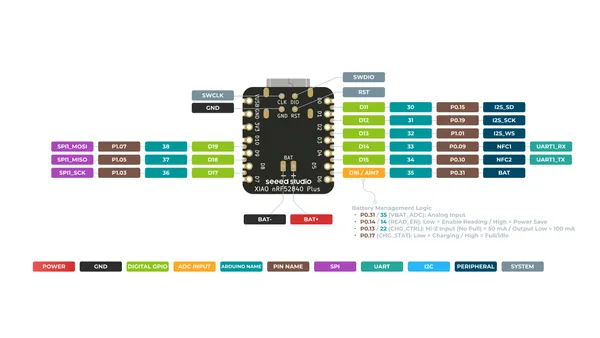
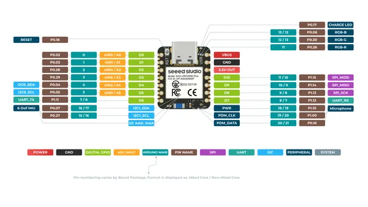

# XIAO nRF52840 Sense Plus

**Seeed Studio** · Other

Revision: Not identified  
Coverage: Pinout image collected

[Browse all manufacturers](../../../../BROWSE.md) · [Desktop app](https://github.com/valleytechsolutions/black-wire-desktop)

## Pinout (Back)

**pinout image** · Reviewed source · PNG

[Open original reference](../../../../library/media/a04ca9ffa6c785cf13fa1e4261e0981b95f0d1e10a31f76fd216ccea66020462.png)

**Credit and rights:** Not established; source attribution retained. Source/manufacturer: Seeed Studio.

[Source 1](https://files.seeedstudio.com/wiki/XIAO-BLE/XIAO_nRF52840_Sense_Plus_back_pinout.png) · [Source 2](https://wiki.seeedstudio.com/XIAO_BLE/)

SHA-256: `a04ca9ffa6c785cf13fa1e4261e0981b95f0d1e10a31f76fd216ccea66020462`

## Pinout (Front)

**pinout image** · Reviewed source · PNG

[Open original reference](../../../../library/media/27596622304eed73d1a3718502832005cf033a96a5c440634531f8c5a05c2983.png)

**Credit and rights:** Not established; source attribution retained. Source/manufacturer: Seeed Studio.

[Source 1](https://files.seeedstudio.com/wiki/XIAO-BLE/XIAO_nRF52840_Sense_Plus_front_pinout.png) · [Source 2](https://wiki.seeedstudio.com/XIAO_BLE/)

SHA-256: `27596622304eed73d1a3718502832005cf033a96a5c440634531f8c5a05c2983`

Pin assignments have not been independently electrically verified. Check board revision before wiring.
