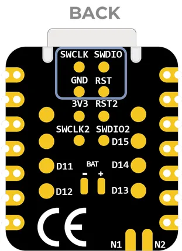
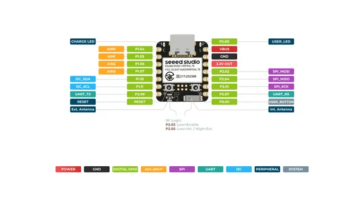

# XIAO nRF54L15

**Seeed Studio** · Other

Revision: Not identified  
Coverage: Pinout image collected

[Browse all manufacturers](../../../../BROWSE.md) · [Desktop app](https://github.com/valleytechsolutions/black-wire-desktop)

## Pinout (Back) (SWD Pads)

**pinout image** · Reviewed source · PNG

[Open original reference](../../../../library/media/4fe2a25110d4c35b3be242c29e926ac63cc70c3f277651f85d8f70da88199262.png)

**Credit and rights:** Not established; source attribution retained. Source/manufacturer: Seeed Studio.

[Source 1](https://files.seeedstudio.com/wiki/XIAO_nRF54L15/Getting_Start/j_link.png) · [Source 2](https://wiki.seeedstudio.com/xiao_nrf54l15_sense_getting_started/)

SHA-256: `4fe2a25110d4c35b3be242c29e926ac63cc70c3f277651f85d8f70da88199262`

## Pinout (Back)

**pinout image** · Reviewed source · PNG

[Open original reference](../../../../library/media/ef97b35e6b9e5595f0417242ae9b566eecbc9d0b8081f9d65cf3523afc5f94c0.png)

**Credit and rights:** Not established; source attribution retained. Source/manufacturer: Seeed Studio.

[Source 1](https://files.seeedstudio.com/wiki/XIAO_nRF54L15/Getting_Start/XIAO_nRF54L15_back_pinout.png) · [Source 2](https://wiki.seeedstudio.com/xiao_nrf54l15_sense_getting_started/)

SHA-256: `ef97b35e6b9e5595f0417242ae9b566eecbc9d0b8081f9d65cf3523afc5f94c0`

## Pinout (Front)

**pinout image** · Reviewed source · PNG

[Open original reference](../../../../library/media/76fdc1c3dd5aa13fb3a94e055a1b2eba33051f43f906cc8df4e26a40b6b5d365.png)

**Credit and rights:** Not established; source attribution retained. Source/manufacturer: Seeed Studio.

[Source 1](https://files.seeedstudio.com/wiki/XIAO_nRF54L15/Getting_Start/XIAO_nRF54L15_front_pinout.png) · [Source 2](https://wiki.seeedstudio.com/xiao_nrf54l15_sense_getting_started/)

SHA-256: `76fdc1c3dd5aa13fb3a94e055a1b2eba33051f43f906cc8df4e26a40b6b5d365`

## Pinout Sheet

**source reference** · Unreviewed source · XLSX

[Open original reference](../../../../library/media/e20d3eac300188e0280a857a303f643ea43a63bd0d5ee77384229fad28209d7f.xlsx)

**Credit and rights:** Source rights not yet established. Source/manufacturer: Seeed Studio.

[Source 1](https://files.seeedstudio.com/wiki/XIAO_nRF54L15/Getting_Start/XIAO_nRF54L15datasheet.xlsx) · [Source 2](https://wiki.seeedstudio.com/xiao_nrf54l15_sense_getting_started/)

Original source index: Pinout Sheet. This file is searchable but has not been promoted to a reviewed physical board pinout.

SHA-256: `e20d3eac300188e0280a857a303f643ea43a63bd0d5ee77384229fad28209d7f`

Pin assignments have not been independently electrically verified. Check board revision before wiring.
