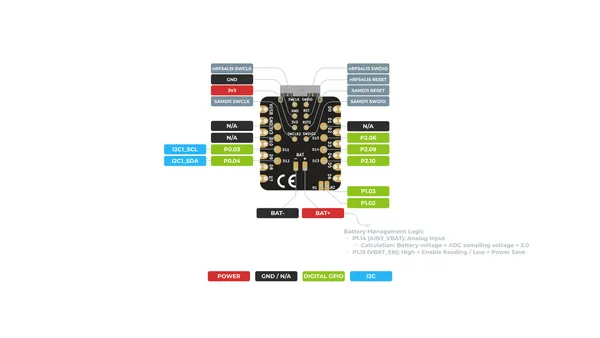
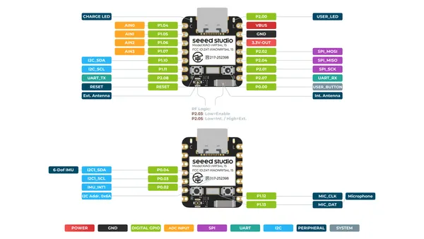

# XIAO nRF54L15 Sense

**Seeed Studio** · Other

Revision: Not identified  
Coverage: Pinout image collected

[Browse all manufacturers](../../../../BROWSE.md) · [Desktop app](https://github.com/valleytechsolutions/black-wire-desktop)

## Pinout (Back)

**pinout image** · Reviewed source · PNG

[Open original reference](../../../../library/media/ef97b35e6b9e5595f0417242ae9b566eecbc9d0b8081f9d65cf3523afc5f94c0.png)

**Credit and rights:** Not established; source attribution retained. Source/manufacturer: Seeed Studio.

[Source 1](https://files.seeedstudio.com/wiki/XIAO_nRF54L15/Getting_Start/XIAO_nRF54L15_Sense_back_pinout.png) · [Source 2](https://wiki.seeedstudio.com/xiao_nrf54l15_sense_getting_started/)

SHA-256: `ef97b35e6b9e5595f0417242ae9b566eecbc9d0b8081f9d65cf3523afc5f94c0`

## Pinout (Front)

**pinout image** · Reviewed source · PNG

[Open original reference](../../../../library/media/dff4e67deee2bf7de2ea05d951a85031a6979bc79cdae9f405193d5ca6278989.png)

**Credit and rights:** Not established; source attribution retained. Source/manufacturer: Seeed Studio.

[Source 1](https://files.seeedstudio.com/wiki/XIAO_nRF54L15/Getting_Start/XIAO_nRF54L15_Sense_front_pinout.png) · [Source 2](https://wiki.seeedstudio.com/xiao_nrf54l15_sense_getting_started/)

SHA-256: `dff4e67deee2bf7de2ea05d951a85031a6979bc79cdae9f405193d5ca6278989`

Pin assignments have not been independently electrically verified. Check board revision before wiring.
