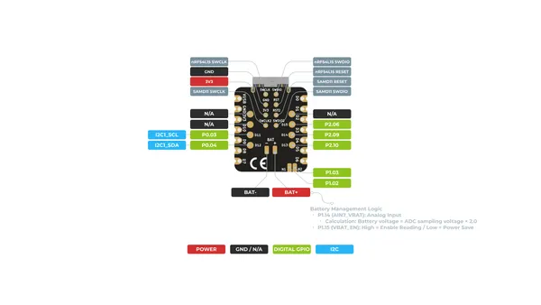
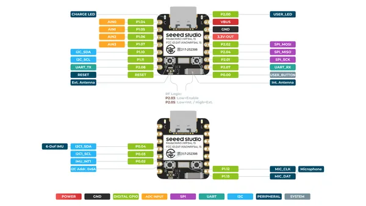
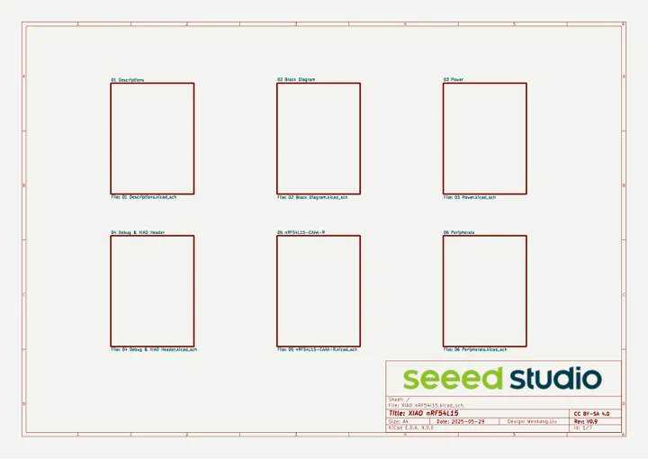

# XIAO nRF54L15 Sense

**Seeed Studio** · Other

Revision: Not identified

Coverage: Manufacturer references reviewed by scope; independent electrical and all-connector review pending

[Browse all manufacturers](../../../../BROWSE.md) · [Devices & IoT](../../../../DEVICES.md) · [Open in the browser guide](https://valleytech-black-wire-guide.pages.dev/?board=seeed-studio-other-xiao-nrf54l15-sense)

## Datasheets and original documentation

Board datasheet: **not yet recorded**. Visual reference: **available**.

[Manufacturer hardware documentation](https://wiki.seeedstudio.com/xiao_nrf54l15_sense_getting_started/)

- **schematic / board**: [XIAO nRF54L15 Sense Schematic](https://files.seeedstudio.com/wiki/XIAO_nRF54L15/Getting_Start/nRF54L15_Sense_Schematic.pdf) · [saved document](../../../../library/media/5247dfdd76763332bc8493831642e22a270a89d7c2c34a9f4610d3fa20633e65.pdf)
- **hardware-guide / board**: [Manufacturer pin and hardware documentation](https://wiki.seeedstudio.com/xiao_nrf54l15_sense_getting_started/) · online

A chip datasheet, schematic and board datasheet have different scopes. Match the exact hardware revision.

[Documentation coverage and remaining gaps](../../../../DOCUMENTATION.md)

## Pinout (Back)

**pinout image** · Reviewed source · PNG

[Open original reference](../../../../library/media/ef97b35e6b9e5595f0417242ae9b566eecbc9d0b8081f9d65cf3523afc5f94c0.png)

**Credit and rights:** Not established; source attribution retained. Source/manufacturer: Seeed Studio.

[Source 1](https://files.seeedstudio.com/wiki/XIAO_nRF54L15/Getting_Start/XIAO_nRF54L15_Sense_back_pinout.png) · [Source 2](https://wiki.seeedstudio.com/xiao_nrf54l15_sense_getting_started/)

Image revision: Not identified

SHA-256: `ef97b35e6b9e5595f0417242ae9b566eecbc9d0b8081f9d65cf3523afc5f94c0`

## Pinout (Front)

**pinout image** · Reviewed source · PNG

[Open original reference](../../../../library/media/dff4e67deee2bf7de2ea05d951a85031a6979bc79cdae9f405193d5ca6278989.png)

**Credit and rights:** Not established; source attribution retained. Source/manufacturer: Seeed Studio.

[Source 1](https://files.seeedstudio.com/wiki/XIAO_nRF54L15/Getting_Start/XIAO_nRF54L15_Sense_front_pinout.png) · [Source 2](https://wiki.seeedstudio.com/xiao_nrf54l15_sense_getting_started/)

Image revision: Not identified

SHA-256: `dff4e67deee2bf7de2ea05d951a85031a6979bc79cdae9f405193d5ca6278989`

## XIAO nRF54L15 Sense Schematic

**original reference PDF** · Source identity and visual scope inspected; PDF review covers first-page preview. Independent electrical and all-connector completeness review pending. · PDF

[Open original reference](../../../../library/media/5247dfdd76763332bc8493831642e22a270a89d7c2c34a9f4610d3fa20633e65.pdf)

**Credit and rights:** Manufacturer artwork; reuse and print rights not established. Inclusion does not relicense the original.. Source/manufacturer: Seeed Studio.

[Source 1](https://files.seeedstudio.com/wiki/XIAO_nRF54L15/Getting_Start/nRF54L15_Sense_Schematic.pdf) · [Source 2](https://wiki.seeedstudio.com/xiao_nrf54l15_sense_getting_started/)

Manufacturer source retained unchanged. Source identity and visual scope inspected; PDF review covers first-page preview. Independent electrical and all-connector completeness review pending.

Image revision: As supplied in the original; match exact board revision

SHA-256: `5247dfdd76763332bc8493831642e22a270a89d7c2c34a9f4610d3fa20633e65`

Pin assignments have not been independently electrically verified. Check board revision before wiring.
