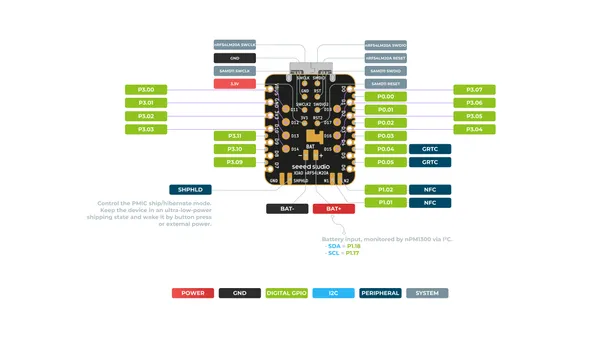
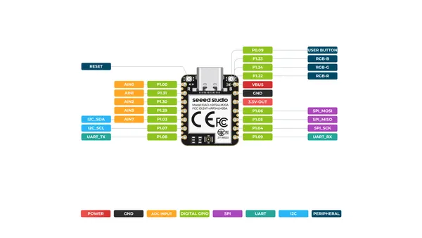

# XIAO nRF54LM20A

**Seeed Studio** · Other

Revision: Not identified  
Coverage: Pinout image collected

[Browse all manufacturers](../../../../BROWSE.md) · [Desktop app](https://github.com/valleytechsolutions/black-wire-desktop)

## Pinout (Back)

**pinout image** · Reviewed source · PNG

[Open original reference](../../../../library/media/9ea7ce37a88c1faf0454d89fe55e0958f626c9061b02e25fc7d4c9754bfdf07f.png)

**Credit and rights:** Not established; source attribution retained. Source/manufacturer: Seeed Studio.

[Source 1](https://files.seeedstudio.com/wiki/XIAO_nRF54LM20A/fix/XIAO_nRF54LM20A_back.png) · [Source 2](https://wiki.seeedstudio.com/xiao_nrf54lm20a_getting_started/)

SHA-256: `9ea7ce37a88c1faf0454d89fe55e0958f626c9061b02e25fc7d4c9754bfdf07f`

## Pinout (Front)

**pinout image** · Reviewed source · PNG

[Open original reference](../../../../library/media/f02082c9753cf9381286bb45cf6833a8b848f7cd29618f634da0ae64d5134419.png)

**Credit and rights:** Not established; source attribution retained. Source/manufacturer: Seeed Studio.

[Source 1](https://files.seeedstudio.com/wiki/XIAO_nRF54LM20A/fix/XIAO_nRF54LM20A_f.png) · [Source 2](https://wiki.seeedstudio.com/xiao_nrf54lm20a_getting_started/)

SHA-256: `f02082c9753cf9381286bb45cf6833a8b848f7cd29618f634da0ae64d5134419`

## Pinout Sheet

**source reference** · Unreviewed source · XLSX

[Open original reference](../../../../library/media/6711bde06e169fa99a567abcce34bb0aa6665bc4a939483faaf31b5682926944.xlsx)

**Credit and rights:** Source rights not yet established. Source/manufacturer: Seeed Studio.

[Source 1](https://files.seeedstudio.com/wiki/XIAO_nRF54LM20A/getting_start/RES/XIAO_nRF54LM20A_Pin_definition.xlsx) · [Source 2](https://wiki.seeedstudio.com/xiao_nrf54lm20a_getting_started/)

Original source index: Pinout Sheet. This file is searchable but has not been promoted to a reviewed physical board pinout.

SHA-256: `6711bde06e169fa99a567abcce34bb0aa6665bc4a939483faaf31b5682926944`

Pin assignments have not been independently electrically verified. Check board revision before wiring.
