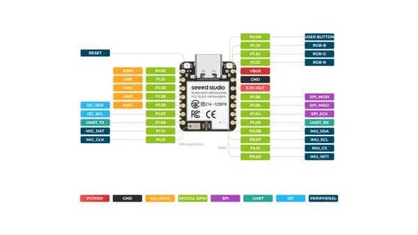
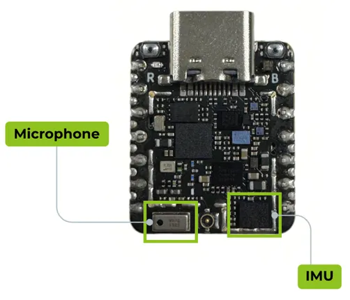

# XIAO nRF54LM20A Sense

**Seeed Studio** · Other

Revision: Not identified  
Coverage: Pinout image collected

[Browse all manufacturers](../../../../BROWSE.md) · [Desktop app](https://github.com/valleytechsolutions/black-wire-desktop)

## Pinout (Back)

**pinout image** · Reviewed source · PNG

[Open original reference](../../../../library/media/9ea7ce37a88c1faf0454d89fe55e0958f626c9061b02e25fc7d4c9754bfdf07f.png)

**Credit and rights:** Not established; source attribution retained. Source/manufacturer: Seeed Studio.

[Source 1](https://files.seeedstudio.com/wiki/XIAO_nRF54LM20A/getting_start/getting_start/5_pin.png) · [Source 2](https://wiki.seeedstudio.com/xiao_nrf54lm20a_getting_started/)

SHA-256: `9ea7ce37a88c1faf0454d89fe55e0958f626c9061b02e25fc7d4c9754bfdf07f`

## Pinout (Front)

**pinout image** · Reviewed source · PNG

[Open original reference](../../../../library/media/042eaafac2173dbd0f4f66f49294af112a447c41f33e9cd01d9dbe3343501a1b.png)

**Credit and rights:** Not established; source attribution retained. Source/manufacturer: Seeed Studio.

[Source 1](https://files.seeedstudio.com/wiki/XIAO_nRF54LM20A/getting_start/getting_start/4_pin.png) · [Source 2](https://wiki.seeedstudio.com/xiao_nrf54lm20a_getting_started/)

SHA-256: `042eaafac2173dbd0f4f66f49294af112a447c41f33e9cd01d9dbe3343501a1b`

## Hardware Overview

**source reference** · Unreviewed source · PNG

[Open original reference](../../../../library/media/2f49f4de6ee1d41207437bbd96298a69d1fa3b035cefdde856a52d03488405e6.png)

**Credit and rights:** Source rights not yet established. Source/manufacturer: Seeed Studio.

[Source 1](https://files.seeedstudio.com/wiki/XIAO_nRF54LM20A/getting_start/getting_start/8.IMU_MIC.png) · [Source 2](https://wiki.seeedstudio.com/xiao_nrf54lm20a_getting_started/)

Original source index: Hardware Overview. This file is searchable but has not been promoted to a reviewed physical board pinout.

SHA-256: `2f49f4de6ee1d41207437bbd96298a69d1fa3b035cefdde856a52d03488405e6`

Pin assignments have not been independently electrically verified. Check board revision before wiring.
