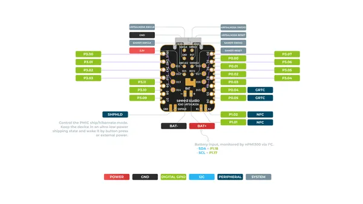
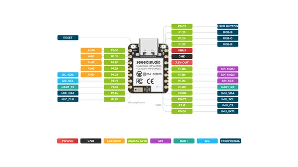
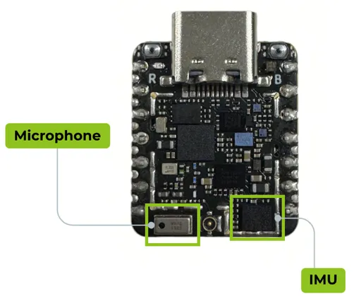
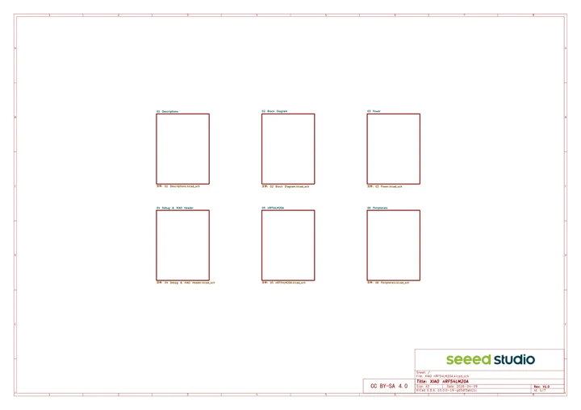

# XIAO nRF54LM20A Sense

**Seeed Studio** · Other

Revision: Not identified

Coverage: Manufacturer references reviewed by scope; independent electrical and all-connector review pending

[Browse all manufacturers](../../../../BROWSE.md) · [Devices & IoT](../../../../DEVICES.md) · [Open in the browser guide](https://valleytech-black-wire-guide.pages.dev/?board=seeed-studio-other-xiao-nrf54lm20a-sense)

## Datasheets and original documentation

Board datasheet: **not yet recorded**. Visual reference: **available**.

[Manufacturer hardware documentation](https://wiki.seeedstudio.com/xiao_nrf54lm20a_getting_started/)

- **schematic / board**: [XIAO nRF54LM20A Sense Schematic](https://files.seeedstudio.com/wiki/XIAO_nRF54LM20A/getting_start/RES/XIAO_nRF54LM20A_Schematic.pdf) · [saved document](../../../../library/media/f877501a6ff64b1fd9da15eb7df643c339f426869e8cf81ca4c727ec97260da3.pdf)
- **hardware-guide / board**: [Manufacturer pin and hardware documentation](https://wiki.seeedstudio.com/xiao_nrf54lm20a_getting_started/) · online

A chip datasheet, schematic and board datasheet have different scopes. Match the exact hardware revision.

[Documentation coverage and remaining gaps](../../../../DOCUMENTATION.md)

## Pinout (Back)

**pinout image** · Reviewed source · PNG

[Open original reference](../../../../library/media/9ea7ce37a88c1faf0454d89fe55e0958f626c9061b02e25fc7d4c9754bfdf07f.png)

**Credit and rights:** Not established; source attribution retained. Source/manufacturer: Seeed Studio.

[Source 1](https://files.seeedstudio.com/wiki/XIAO_nRF54LM20A/getting_start/getting_start/5_pin.png) · [Source 2](https://wiki.seeedstudio.com/xiao_nrf54lm20a_getting_started/)

Image revision: Not identified

SHA-256: `9ea7ce37a88c1faf0454d89fe55e0958f626c9061b02e25fc7d4c9754bfdf07f`

## Pinout (Front)

**pinout image** · Reviewed source · PNG

[Open original reference](../../../../library/media/042eaafac2173dbd0f4f66f49294af112a447c41f33e9cd01d9dbe3343501a1b.png)

**Credit and rights:** Not established; source attribution retained. Source/manufacturer: Seeed Studio.

[Source 1](https://files.seeedstudio.com/wiki/XIAO_nRF54LM20A/getting_start/getting_start/4_pin.png) · [Source 2](https://wiki.seeedstudio.com/xiao_nrf54lm20a_getting_started/)

Image revision: Not identified

SHA-256: `042eaafac2173dbd0f4f66f49294af112a447c41f33e9cd01d9dbe3343501a1b`

## Hardware Overview

**source reference** · Unreviewed source · PNG

[Open original reference](../../../../library/media/2f49f4de6ee1d41207437bbd96298a69d1fa3b035cefdde856a52d03488405e6.png)

**Credit and rights:** Source rights not yet established. Source/manufacturer: Seeed Studio.

[Source 1](https://files.seeedstudio.com/wiki/XIAO_nRF54LM20A/getting_start/getting_start/8.IMU_MIC.png) · [Source 2](https://wiki.seeedstudio.com/xiao_nrf54lm20a_getting_started/)

Original source index: Hardware Overview. This file is searchable but has not been promoted to a reviewed physical board pinout.

Image revision: Not identified

SHA-256: `2f49f4de6ee1d41207437bbd96298a69d1fa3b035cefdde856a52d03488405e6`

## XIAO nRF54LM20A Sense Schematic

**original reference PDF** · Source identity and visual scope inspected; PDF review covers first-page preview. Independent electrical and all-connector completeness review pending. · PDF

[Open original reference](../../../../library/media/f877501a6ff64b1fd9da15eb7df643c339f426869e8cf81ca4c727ec97260da3.pdf)

**Credit and rights:** Manufacturer artwork; reuse and print rights not established. Inclusion does not relicense the original.. Source/manufacturer: Seeed Studio.

[Source 1](https://files.seeedstudio.com/wiki/XIAO_nRF54LM20A/getting_start/RES/XIAO_nRF54LM20A_Schematic.pdf) · [Source 2](https://wiki.seeedstudio.com/xiao_nrf54lm20a_getting_started/)

Manufacturer source retained unchanged. Source identity and visual scope inspected; PDF review covers first-page preview. Independent electrical and all-connector completeness review pending.

Image revision: As supplied in the original; match exact board revision

SHA-256: `f877501a6ff64b1fd9da15eb7df643c339f426869e8cf81ca4c727ec97260da3`

Pin assignments have not been independently electrically verified. Check board revision before wiring.
