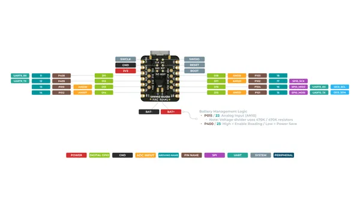
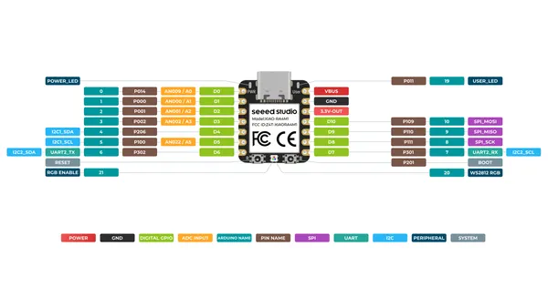

# XIAO RA4M1

**Seeed Studio** · Other

Revision: Not identified  
Coverage: Pinout image collected

[Browse all manufacturers](../../../../BROWSE.md) · [Desktop app](https://github.com/valleytechsolutions/black-wire-desktop)

## Pinout (Back)

**pinout image** · Reviewed source · PNG

[Open original reference](../../../../library/media/886595b571493fdf4f37d2b3a5bb7b95a11f9d5a2572ce05215f1423a999576d.png)

**Credit and rights:** Not established; source attribution retained. Source/manufacturer: Seeed Studio.

[Source 1](https://files.seeedstudio.com/wiki/XIAO-R4AM1/img/XIAO_RA4M1_back_pinout.png) · [Source 2](https://wiki.seeedstudio.com/getting_started_xiao_ra4m1/)

SHA-256: `886595b571493fdf4f37d2b3a5bb7b95a11f9d5a2572ce05215f1423a999576d`

## Pinout (Front)

**pinout image** · Reviewed source · PNG

[Open original reference](../../../../library/media/253ea1087daf0f014f044254800dd85ed7a17de1fdffff85b16c6be3c55d88cb.png)

**Credit and rights:** Not established; source attribution retained. Source/manufacturer: Seeed Studio.

[Source 1](https://files.seeedstudio.com/wiki/XIAO-R4AM1/img/XIAO_RA4M1_front_pinout.png) · [Source 2](https://wiki.seeedstudio.com/getting_started_xiao_ra4m1/)

SHA-256: `253ea1087daf0f014f044254800dd85ed7a17de1fdffff85b16c6be3c55d88cb`

Pin assignments have not been independently electrically verified. Check board revision before wiring.
