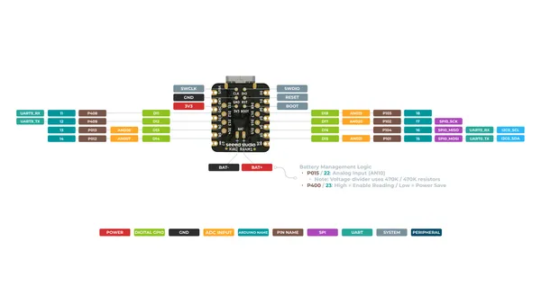
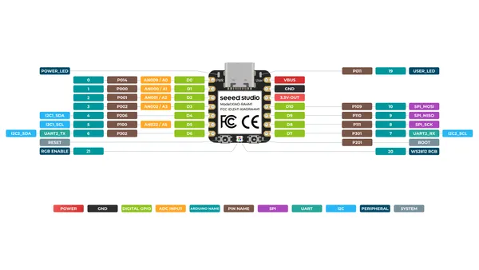
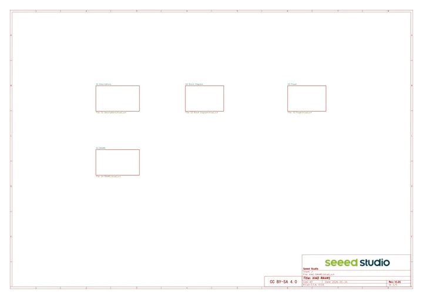

# XIAO RA4M1

**Seeed Studio** · Other

Revision: Not identified

Coverage: Manufacturer references reviewed by scope; independent electrical and all-connector review pending

[Browse all manufacturers](../../../../BROWSE.md) · [Devices & IoT](../../../../DEVICES.md) · [Open in the browser guide](https://valleytech-black-wire-guide.pages.dev/?board=seeed-studio-other-xiao-ra4m1)

## Datasheets and original documentation

Board datasheet: **not yet recorded**. Visual reference: **available**.

[Manufacturer hardware documentation](https://wiki.seeedstudio.com/getting_started_xiao_ra4m1/)

- **schematic / board**: [XIAO RA4M1 Schematic](https://files.seeedstudio.com/wiki/XIAO-R4AM1/res/XIAO%20RA4M1%20V1.01_SCH_PDF_260114%20.pdf.pdf) · [saved document](../../../../library/media/2e87385a9b4f9efc092f48f64ce7551cae2dc45e2a2e1c565e1ccd17a28d7058.pdf)
- **hardware-guide / board**: [Manufacturer pin and hardware documentation](https://wiki.seeedstudio.com/getting_started_xiao_ra4m1/) · online

A chip datasheet, schematic and board datasheet have different scopes. Match the exact hardware revision.

[Documentation coverage and remaining gaps](../../../../DOCUMENTATION.md)

## Pinout (Back)

**pinout image** · Reviewed source · PNG

[Open original reference](../../../../library/media/886595b571493fdf4f37d2b3a5bb7b95a11f9d5a2572ce05215f1423a999576d.png)

**Credit and rights:** Not established; source attribution retained. Source/manufacturer: Seeed Studio.

[Source 1](https://files.seeedstudio.com/wiki/XIAO-R4AM1/img/XIAO_RA4M1_back_pinout.png) · [Source 2](https://wiki.seeedstudio.com/getting_started_xiao_ra4m1/)

Image revision: Not identified

SHA-256: `886595b571493fdf4f37d2b3a5bb7b95a11f9d5a2572ce05215f1423a999576d`

## Pinout (Front)

**pinout image** · Reviewed source · PNG

[Open original reference](../../../../library/media/253ea1087daf0f014f044254800dd85ed7a17de1fdffff85b16c6be3c55d88cb.png)

**Credit and rights:** Not established; source attribution retained. Source/manufacturer: Seeed Studio.

[Source 1](https://files.seeedstudio.com/wiki/XIAO-R4AM1/img/XIAO_RA4M1_front_pinout.png) · [Source 2](https://wiki.seeedstudio.com/getting_started_xiao_ra4m1/)

Image revision: Not identified

SHA-256: `253ea1087daf0f014f044254800dd85ed7a17de1fdffff85b16c6be3c55d88cb`

## XIAO RA4M1 Schematic

**original reference PDF** · Source identity and visual scope inspected; PDF review covers first-page preview. Independent electrical and all-connector completeness review pending. · PDF

[Open original reference](../../../../library/media/2e87385a9b4f9efc092f48f64ce7551cae2dc45e2a2e1c565e1ccd17a28d7058.pdf)

**Credit and rights:** Manufacturer artwork; reuse and print rights not established. Inclusion does not relicense the original.. Source/manufacturer: Seeed Studio.

[Source 1](https://files.seeedstudio.com/wiki/XIAO-R4AM1/res/XIAO%20RA4M1%20V1.01_SCH_PDF_260114%20.pdf.pdf) · [Source 2](https://wiki.seeedstudio.com/getting_started_xiao_ra4m1/)

Manufacturer source retained unchanged. Source identity and visual scope inspected; PDF review covers first-page preview. Independent electrical and all-connector completeness review pending.

Image revision: As supplied in the original; match exact board revision

SHA-256: `2e87385a9b4f9efc092f48f64ce7551cae2dc45e2a2e1c565e1ccd17a28d7058`

Pin assignments have not been independently electrically verified. Check board revision before wiring.
