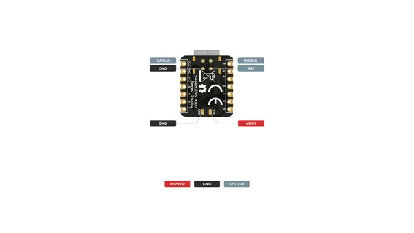
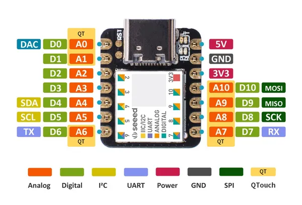
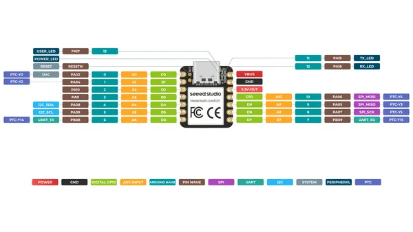
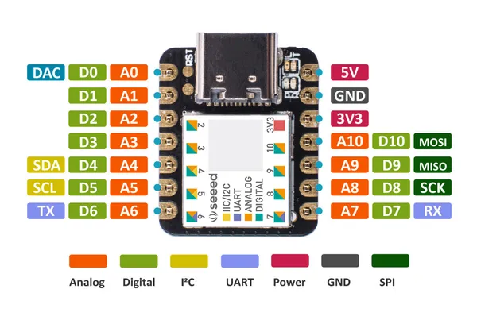

# XIAO SAMD21

**Seeed Studio** · Other

Revision: Not identified  
Coverage: Pinout image collected

[Browse all manufacturers](../../../../BROWSE.md) · [Desktop app](https://github.com/valleytechsolutions/black-wire-desktop)

## Pinout (Back)

**pinout image** · Reviewed source · PNG

[Open original reference](../../../../library/media/8da55c4b38fd192e952e18e89f42fb0aca6989bacac8ff3b48007b2c46c80a87.png)

**Credit and rights:** Not established; source attribution retained. Source/manufacturer: Seeed Studio.

[Source 1](https://files.seeedstudio.com/wiki/Seeeduino-XIAO/img/XIAO_SAMD21_back_pinout.png) · [Source 2](https://wiki.seeedstudio.com/Seeeduino-XIAO/)

SHA-256: `8da55c4b38fd192e952e18e89f42fb0aca6989bacac8ff3b48007b2c46c80a87`

## Pinout (Front) (QTouch)

**pinout image** · Reviewed source · JPG

[Open original reference](../../../../library/media/1bd0b1afe02b023362dcfa28f587e56a23a197f819817e58fec967a86d4e88d2.jpg)

**Credit and rights:** Not established; source attribution retained. Source/manufacturer: Seeed Studio.

[Source 1](https://files.seeedstudio.com/wiki/Seeeduino-XIAO/img/Seeeduino-XIAO-pinout-1.jpg) · [Source 2](https://wiki.seeedstudio.com/XIAO-SAMD21-Zephyr-RTOS/)

SHA-256: `1bd0b1afe02b023362dcfa28f587e56a23a197f819817e58fec967a86d4e88d2`

## Pinout (Front)

**pinout image** · Reviewed source · PNG

[Open original reference](../../../../library/media/e327fae80cf3f1f46a5a24f4794f6ac812ab0847284d25a22d2c98350b41b92d.png)

**Credit and rights:** Not established; source attribution retained. Source/manufacturer: Seeed Studio.

[Source 1](https://files.seeedstudio.com/wiki/Seeeduino-XIAO/img/XIAO_SAMD21_front_pinout.png) · [Source 2](https://wiki.seeedstudio.com/Seeeduino-XIAO/)

SHA-256: `e327fae80cf3f1f46a5a24f4794f6ac812ab0847284d25a22d2c98350b41b92d`

## Pinout

**pinout image** · Reviewed source · JPG

[Open original reference](../../../../library/media/93bd6c34807afb43b88523b2a2b7d16dd588e0a2405e83a430ac7dd70cd239bf.jpg)

**Credit and rights:** Not established; source attribution retained. Source/manufacturer: Seeed Studio.

[Source 1](https://files.seeedstudio.com/wiki/Seeeduino-XIAO/img/Seeeduino-XIAO-pinout.jpg) · [Source 2](https://wiki.seeedstudio.com/ArduPy/)

SHA-256: `93bd6c34807afb43b88523b2a2b7d16dd588e0a2405e83a430ac7dd70cd239bf`

## Pinout Sheet

**source reference** · Unreviewed source · XLSX

[Open original reference](../../../../library/media/4d4683f5f101bb8e0bd82e3aa940686e8c1ed6744828f5fdb7ef41fe10a65fc8.xlsx)

**Credit and rights:** Source rights not yet established. Source/manufacturer: Seeed Studio.

[Source 1](https://files.seeedstudio.com/wiki/Seeeduino-XIAO/res/XIAO-SAMD21-pinout_sheet.xlsx) · [Source 2](https://wiki.seeedstudio.com/Seeeduino-XIAO/)

Original source index: Pinout Sheet. This file is searchable but has not been promoted to a reviewed physical board pinout.

SHA-256: `4d4683f5f101bb8e0bd82e3aa940686e8c1ed6744828f5fdb7ef41fe10a65fc8`

Pin assignments have not been independently electrically verified. Check board revision before wiring.
