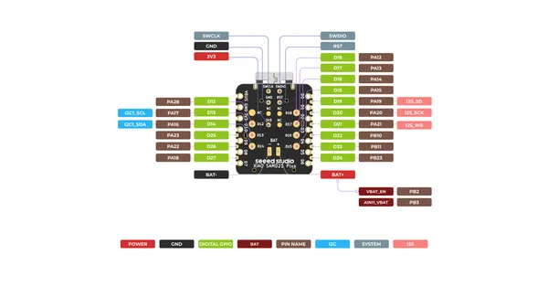
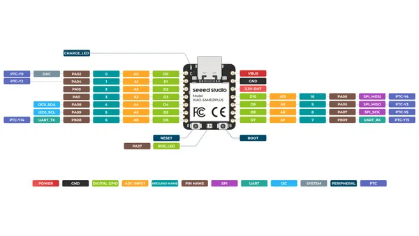

# XIAO SAMD21 Plus

**Seeed Studio** · Other

Revision: Not identified  
Coverage: Pinout image collected

[Browse all manufacturers](../../../../BROWSE.md) · [Desktop app](https://github.com/valleytechsolutions/black-wire-desktop)

## Pinout (Back)

**pinout image** · Reviewed source · PNG

[Open original reference](../../../../library/media/cfd5d5a804e0913edd152da1e521d7d3cfc9da50268605de9328918e7ce83465.png)

**Credit and rights:** Not established; source attribution retained. Source/manufacturer: Seeed Studio.

[Source 1](https://files.seeedstudio.com/wiki/Seeeduino-XIAO/img/XIAO-SAMD21-Plus-Back.png) · [Source 2](https://wiki.seeedstudio.com/Seeeduino-XIAO/)

SHA-256: `cfd5d5a804e0913edd152da1e521d7d3cfc9da50268605de9328918e7ce83465`

## Pinout (Front)

**pinout image** · Reviewed source · PNG

[Open original reference](../../../../library/media/7baa703b76bbaf0de45b2c245e0489cd031b020b44474a88bfdbb136456aa1b4.png)

**Credit and rights:** Not established; source attribution retained. Source/manufacturer: Seeed Studio.

[Source 1](https://files.seeedstudio.com/wiki/Seeeduino-XIAO/img/XIAO-SAMD21-Plus-Front.png) · [Source 2](https://wiki.seeedstudio.com/Seeeduino-XIAO/)

SHA-256: `7baa703b76bbaf0de45b2c245e0489cd031b020b44474a88bfdbb136456aa1b4`

## Pinout Sheet

**source reference** · Unreviewed source · XLSX

[Open original reference](../../../../library/media/a2792bb9a3540047d63591e0b9fe7cc4f0a7b33ff2a5a6cc087977f61495f86e.xlsx)

**Credit and rights:** Source rights not yet established. Source/manufacturer: Seeed Studio.

[Source 1](https://files.seeedstudio.com/wiki/Seeeduino-XIAO/res/XIAO-SAMD21-PLUS-pinout_sheet.xlsx) · [Source 2](https://wiki.seeedstudio.com/Seeeduino-XIAO/)

Original source index: Pinout Sheet. This file is searchable but has not been promoted to a reviewed physical board pinout.

SHA-256: `a2792bb9a3540047d63591e0b9fe7cc4f0a7b33ff2a5a6cc087977f61495f86e`

Pin assignments have not been independently electrically verified. Check board revision before wiring.
