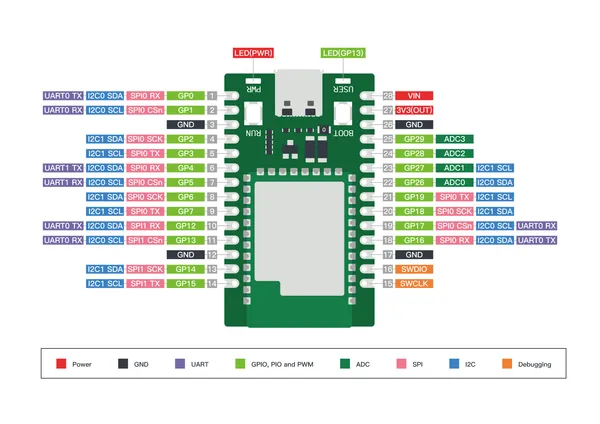
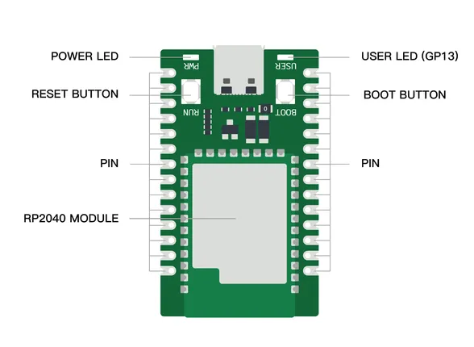

# Wio RP2040 mini Dev Board

**Seeed Studio** · RP2040

Revision: Not identified  
Coverage: Pinout image collected

[Browse all manufacturers](../../../../BROWSE.md) · [Desktop app](https://github.com/valleytechsolutions/black-wire-desktop)

## Pinout

**pinout image** · Reviewed source · PNG

[Open original reference](../../../../library/media/fb390ccd0a71f3e239c6244107057e0022f197ac8ee6537cd57af6be87f6b5c7.png)

**Credit and rights:** Not established; source attribution retained. Source/manufacturer: Seeed Studio.

[Source 1](https://files.seeedstudio.com/wiki/Wio_RP2040_mini_Dev_Board-Onboard_Wifi/board_4.png) · [Source 2](https://wiki.seeedstudio.com/Wio_RP2040_mini_Dev_Board-Onboard_Wifi/)

Imported from existing Seeed Studio Board Reference; original working path preserved.

SHA-256: `fb390ccd0a71f3e239c6244107057e0022f197ac8ee6537cd57af6be87f6b5c7`

## Hardware Overview

**source reference** · Unreviewed source · PNG

[Open original reference](../../../../library/media/480db34161bb4da56e4e9516c7018eebf454af1107f73c2d4b853e772e09c84f.png)

**Credit and rights:** Source rights not yet established. Source/manufacturer: Seeed Studio.

[Source 1](https://files.seeedstudio.com/wiki/Wio_RP2040_mini_Dev_Board-Onboard_Wifi/board_3.png) · [Source 2](https://wiki.seeedstudio.com/Wio_RP2040_mini_Dev_Board-Onboard_Wifi/)

Original source index: Hardware Overview. This file is searchable but has not been promoted to a reviewed physical board pinout.

SHA-256: `480db34161bb4da56e4e9516c7018eebf454af1107f73c2d4b853e772e09c84f`

Pin assignments have not been independently electrically verified. Check board revision before wiring.
