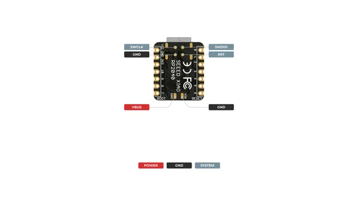
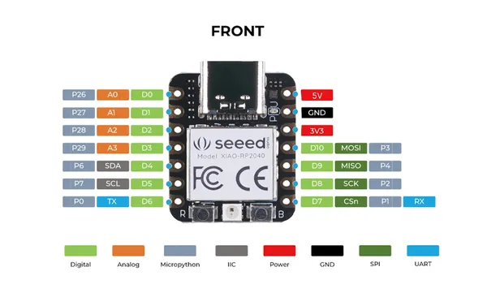
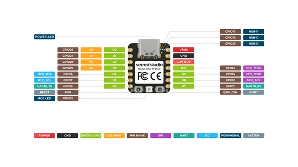
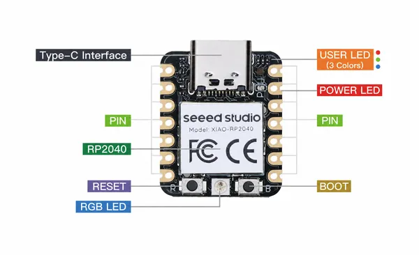

# XIAO RP2040

**Seeed Studio** · RP2040

Revision: Not identified  
Coverage: Pinout image collected

[Browse all manufacturers](../../../../BROWSE.md) · [Desktop app](https://github.com/valleytechsolutions/black-wire-desktop)

## Pinout (Back)

**pinout image** · Reviewed source · PNG

[Open original reference](../../../../library/media/49fdd97bfe3d13f0d1bb3c7daceefb54a65302670879b8e6f18f3677b68a1bb2.png)

**Credit and rights:** Not established; source attribution retained. Source/manufacturer: Seeed Studio.

[Source 1](https://files.seeedstudio.com/wiki/XIAO-RP2040/img/XIAO_RP2040_back_pinout.png) · [Source 2](https://wiki.seeedstudio.com/XIAO-RP2040/)

SHA-256: `49fdd97bfe3d13f0d1bb3c7daceefb54a65302670879b8e6f18f3677b68a1bb2`

## Pinout (Front) (MicroPython)

**pinout image** · Reviewed source · PNG

[Open original reference](../../../../library/media/e136526faa27c571c058a40ab6168a85ef0300c41f28184b81e1c638d0fd47c8.png)

**Credit and rights:** Not established; source attribution retained. Source/manufacturer: Seeed Studio.

[Source 1](https://files.seeedstudio.com/wiki/XIAO-RP2040/img/xinpin.jpg) · [Source 2](https://wiki.seeedstudio.com/XIAO-RP2040-Zephyr-RTOS/)

SHA-256: `e136526faa27c571c058a40ab6168a85ef0300c41f28184b81e1c638d0fd47c8`

## Pinout (Front)

**pinout image** · Reviewed source · PNG

[Open original reference](../../../../library/media/03264c36771c5245fcf621393dae662e745e14a8e6737becc00bd4cd6de3f405.png)

**Credit and rights:** Not established; source attribution retained. Source/manufacturer: Seeed Studio.

[Source 1](https://files.seeedstudio.com/wiki/XIAO-RP2040/img/XIAO_RP2040_front_pinout.png) · [Source 2](https://wiki.seeedstudio.com/XIAO-RP2040/)

SHA-256: `03264c36771c5245fcf621393dae662e745e14a8e6737becc00bd4cd6de3f405`

## Hardware Overview

**source reference** · Unreviewed source · PNG

[Open original reference](../../../../library/media/e28e751449ecb3673d22256bbbea988565e9ab102c1f4d8ea54ae93167c033fd.png)

**Credit and rights:** Source rights not yet established. Source/manufacturer: Seeed Studio.

[Source 1](https://files.seeedstudio.com/wiki/XIAO-RP2040/img/xinfront.png) · [Source 2](https://wiki.seeedstudio.com/XIAO-RP2040/)

Original source index: Hardware Overview. This file is searchable but has not been promoted to a reviewed physical board pinout.

SHA-256: `e28e751449ecb3673d22256bbbea988565e9ab102c1f4d8ea54ae93167c033fd`

## Pinout Sheet

**source reference** · Unreviewed source · XLSX

[Open original reference](../../../../library/media/223c9aa622f1799e4d57e9a9a02b525366699402f44edc71c41bf12fd49de8e9.xlsx)

**Credit and rights:** Source rights not yet established. Source/manufacturer: Seeed Studio.

[Source 1](https://files.seeedstudio.com/wiki/XIAO-RP2040/res/XIAO-RP2040-pinout_sheet.xlsx) · [Source 2](https://wiki.seeedstudio.com/XIAO-RP2040/)

Original source index: Pinout Sheet. This file is searchable but has not been promoted to a reviewed physical board pinout.

SHA-256: `223c9aa622f1799e4d57e9a9a02b525366699402f44edc71c41bf12fd49de8e9`

Pin assignments have not been independently electrically verified. Check board revision before wiring.
